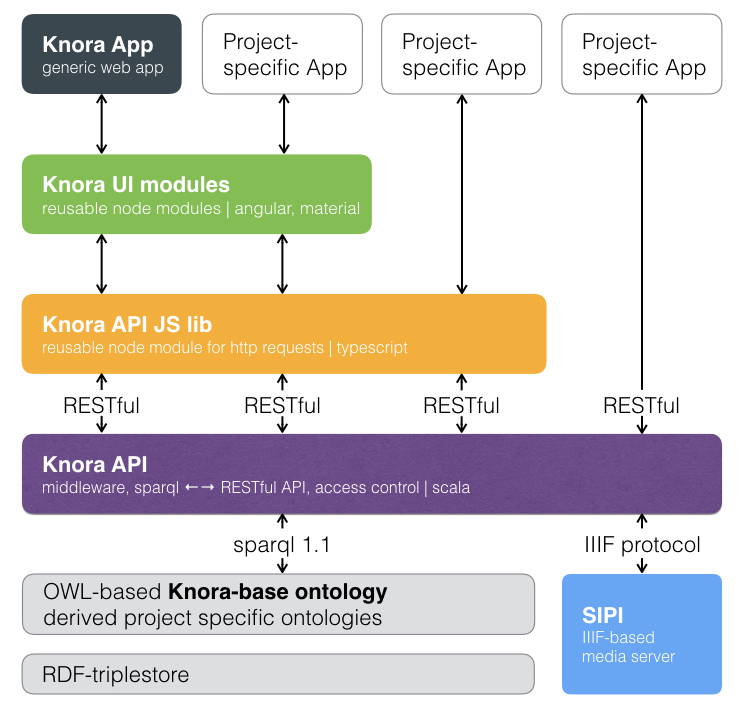
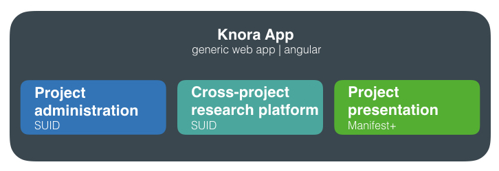

# Introduction to DSP-API

The main software framework in the back-end of the DaSCH Service Platform is called DSP-API (previously Knora). DSP-API is a content management system for the long-term preservation and reuse of humanities data. It is designed to accommodate data with a complex internal structure, including data that could be stored in relational databases.

DSP-API aims to solve key problems in the long-term preservation and reuse of humanities data:

* Traditional archives preserve data, but do not facilitate reuse. Typically, only metadata can be searched, not the data itself. Downloading the data to check whether the data are interesting or not is time-consuming and makes it impractical to reuse data from many different sources. DSP-API solves this problem by keeping the data alive. You can query all the data in a DSP repository, not just the metadata. You can import thousands of databases into DSP-API, and run queries that search through all of them at once.
* Another problem is that researchers use a multitude of different data formats, many of which are proprietary and quickly become obsolete. It is not practical to maintain all the programs that were used to create and read old data files, or even all the operating systems that these programs ran on. Instead of preserving all these data formats, DSP-API supports the conversion of all sorts of data to a small number of formats that are suitable for long-term preservation, and that maintain the data’s meaning and structure:
* Non-binary data is stored as **R**esource **D**escription **F**ramework ([RDF](https://www.w3.org/TR/2014/NOTE-rdf11-primer-20140624/)), in a dedicated database called a triplestore. RDF is an open, vendor-independent standard that can express any data structure. For a concise information about RDF basics see [here](./rdf.md).
* Binary media files (images, audio, and video) are converted to a few specialised archival file formats and stored by the media server [SIPI](https://github.com/dasch-swiss/sipi), with metadata stored in the triplestore. For a concise information about SIPI see [here](sipi/index.md).
* Moreover, DSP-API has built-in support for special data structures that occur on a regular basis in humanities data: persistent links, calender-independent dates and flexible searchable text markup.
* Persistent links are a very important feature. If a resource is changed, a new resource will be created in DSP-API. The older version remains available and citable, there will be no dead links. This means that if in a publication an older version is referenced, the cited version still can be displayed, but there will be a notice that a newer version exists with the corresponding link attached to it.
* A date could be given in any kind of calendar - e.g. the Julian, Gregorian, Jewish or Islamic - just to name the most frequent ones. DSP-API stores dates using the Julian day count that was established by astronomers. Use of the Julian day count easily allows for conversion from one calendar into another and to calculate distances between two dates. It is possible to search for a date in one calendar and to convert it into another one.
* Commonly used text markup systems have troubles to cope with overlapping markup. DSP-API solves this problem by using [Standoff/RDF markup](https://docs.knora.org/paradox/01-introduction/standoff-rdf.html) where the markup is stored as RDF data, separately from the text. This enables overlapping markup. DSP-API’s RDF-based standoff is designed to support the needs of complex digital critical editions. DSP-API can import any XML document (including TEI/XML) for storage as standoff/RDF, and can regenerate the original XML document at any time.

The following table contains a non-exhaustive list of data formats and the information on how these formats are stored and managed by DSP-API (and SIPI):

|Original format|Format in DSP-API|
|-----|----|
|Text (XML, LaTEX, Word, etc.)|DSP resources (RDF) containing Standoff/RDF|
|Tabular data, including relational databases |DSP resources|
|Data in tree or graph structures |DSP resources|
|Images (jpg, png, tiff, etc.) | JPEG 2000 files stored by SIPI|
|Audio and video files | format not decided yet, stored by SIPI|
|pdf | stored by SIPI, but data reuse is improved by extracting the text for storage as Standoff/RDF|

DSP-API makes data available for reuse via its generic, standards-based **A**pplication **P**rogramming **I**nterfaces (APIs). A **V**irtual **R**esearch **E**nvironment (VRE) can then use these APIs to search, link together, and add to data from different research projects in a unified way.

The full DSP-API documentation can be found [here](https://docs.knora.org/paradox/index.html).

<br>

## Layout of DaSCH Service Platform

The DaSCH Service Platform is a platform that includes five layers (see Figure 1). The bottom layer consists of an RDF triplestore, the IIIF-based media server [SIPI](sipi/index.md), the `knora-base` ontology and any project specific ontologies that extend the base ontology. The second layer is occupied by the [DSP-API](https://github.com/dasch-swiss/dsp-api) which is a RESTful API, i.e. an application program interface that uses HTTP requests to GET, PUT, POST and DELETE data. The DSP API has an implemented access control. It returns information in JSON-LD format. In order to make the data accessible in an easy way, three more layers are built on top of the DSP API. The [DSP-JS library](libraries/index.md) comprises the third layer, it contains a reusable Node.js module for HTTP requests written in TypeScript. Layer four is occupied by [DSP UI modules](https://dasch-swiss.github.io/dsp-ui-lib). These modules help to create a graphical user interface. They are developed with Angular and TypeScript and designed in such a way that they can be integrated to an Angular project. The top layer is made up of the generic [DSP-APP](https://docs.dasch.swiss/dsp-app) and the more specific project Apps. From the top layer Gravsearch queries are sent to the DSP API, where permissions are checked and the queries translated into SPARQL queries, which are sent further down to the triplestore. The results are returned to the DSP-APP if the user has the sufficient permissions. In such a way, copyrighted material can be protected.

 Figure 1: DaSCH Service Platform architecture.

The generic web app DSP-APP itself consists of three different parts (see Figure 2). First, there is the project administration part where you can manage your project - build your data model, set permissions, add users, etc. Then, there is a cross-project research platform where you search (full text, advanced or expert search), add or modify your data - this is your working environment. The third component is the Manifest+ viewer wich is designed for project presentation. Alternatively, it is possible to build more elaborate project-specific Apps based on the provided DSP-API modules in the different layers. However, it's up to you to keep such project-specific Apps compatible with the latest DSP API version.

 Figure 2: Details of DSP-APP.

Currently, the following programming languages, software and formats are used for the various components:

|Component| Software and formats|
|---------|------|
|RDF triplestore| Apache Jena Fuseki |
|Ontologies| `knora-base` ontology and derived project ontologies|
|SIPI| C++, Lua, API-format: JSON|
|DSP API| Scala, API-formats: JSON-LD, RDF/XML or Turtle|
|DSP-JS| TypeScript, communication with DSP-API|
|DSP-UI modules| Angular modules, TypeScript, uses DSP-JS|
|DSP-APP| Angular, TypeScript, uses DSP-UI modules and DSP-JS|

<br>

## The knora-base ontology

DSP-API has a [base ontology](https://docs.knora.org/paradox/02-knora-ontologies/knora-base.html), i.e. a data model, with pre-defined basic data types. In addition to this base ontology, each project can create its own data model which is capable to describe the types of items it wishes to store. Project specific ontologies **must** be extensions of the `knora-base` ontology.

The `knora-base` ontology is identified by the IRI `http://www.knora.org/ontology/knora-base`. In our documents it will be identified by the prefix `knora-base` or simply `kb`. TODO: add link to `knora-base` doc.

<br>

## Standoff/RDF Text Markup

[Standoff markup](http://uahost.uantwerpen.be/lse/index.php/lexicon/markup-standoff/) is text markup that is stored separately from the content it describes. DSP-API’s Standoff/RDF markup stores content as a simple Unicode string, and represents markup separately as RDF data. By storing markup as RDF, DSP-API can search for markup structures in the same way as for any RDF data structure. This enables searches that combine text-related criteria with other sorts of criteria. For example, if persons and events are represented as DSP resources, and texts are represented in Standoff/RDF, a text can contain tags representing links to persons or events. One could then search for a text that mentions a person who lived in the same city as another person who is the author of a text that mentions an event that occurred during a certain period of time.

In DSP-API’s Standoff/RDF, a tag is an RDF entity that is linked to a [text value](https://docs.knora.org/paradox/02-knora-ontologies/knora-base.html#textvalue). Each tag points to a substring of the text, but has its own semantic properties. It is possible to define own tag classes in the ontology by creating subclasses of the already defined `kb:StandoffTag`, and to attach own properties to them.

```
###  http://www.knora.org/ontology/knora-base#StandoffLinkTag

kb:StandoffLinkTag rdf:type owl:Class ;

              rdfs:subClassOf kb:StandoffTag ,
                              [ rdf:type owl:Restriction ;
                                owl:onProperty kb:standoffTagHasLink ;
                                owl:cardinality "1"^^xsd:nonNegativeInteger
                              ] ;

              rdfs:comment "Represents a reference to a Knora resource in a TextValue"@en .

```

DSP-API supports automatic conversion between XML and Standoff/RDF. This can be achieved by Standoff/RDF storing the order of tags and their hierarchical relationships. Then, an [XML-to-Standoff Mapping](https://docs.knora.org/paradox/03-apis/api-v2/xml-to-standoff-mapping.html) for the standoff tag classes and properties has to be defined. The mapping is written in XML. Afterwards, an XML document can be imported into DSP-API, which will store it in Standoff/RDF format. The following example shows a possible mapping for a knoraDate:

```XML
<?xml version="1.0" encoding="UTF-8"?>
<mapping>
     <mappingElement>
        <tag>
            <name>text</name>
            <class>noClass</class>
            <namespace>noNamespace</namespace>
            <separatesWords>false</separatesWords>
        </tag>
        <standoffClass>
            <classIri>http://www.knora.org/ontology/standoff#StandoffRootTag</classIri>
        </standoffClass>
    </mappingElement>

    <mappingElement>
        <tag>
            <name>mydate</name>
            <class>noClass</class>
            <namespace>noNamespace</namespace>
            <separatesWords>false</separatesWords>
        </tag>
        <standoffClass>
            <classIri>http://www.knora.org/ontology/0001/anything#StandoffEventTag</classIri>
            <attributes>
                <attribute>
                    <attributeName>description</attributeName>
                    <namespace>noNamespace</namespace>
                    <propertyIri>http://www.knora.org/ontology/0001/anything#standoffEventTagHasDescription</propertyIri>
                </attribute>
            </attributes>
            <datatype>
                <type>http://www.knora.org/ontology/knora-base#StandoffDateTag</type>
                <attributeName>knoraDate</attributeName>
            </datatype>
        </standoffClass>
    </mappingElement>
</mapping>
```

Once the mapping has been created, an XML like the following could be sent to DSP-API and converted to standoff:

```XML
<?xml version="1.0" encoding="UTF-8"?>
<text>
    We had a party on <mydate description="new year" knoraDate="GREGORIAN:2016-12-31">New Year's Eve</mydate>. It was a lot of fun.
</text>
```

The text and markup can then be searched using the search language Gravsearch (TODO: add link). When the document is retrieved, DSP-API converts it back to the original XML.

## Using Gravsearch for searches

DSP-API provides a search language called Gravsearch that is based on the SPARQL language. Gravsearch supports DSP’s humanites-focused data structures, including calendar-independent dates and standoff markup, as well as fast full-text searches. This allows for combining text-related criteria with any other criteria in searches. TODO: add link to Gravsearch doc.
