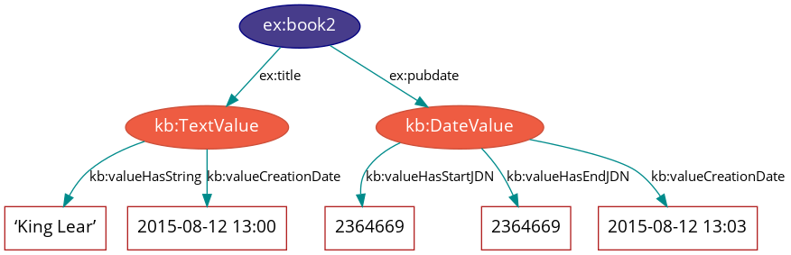
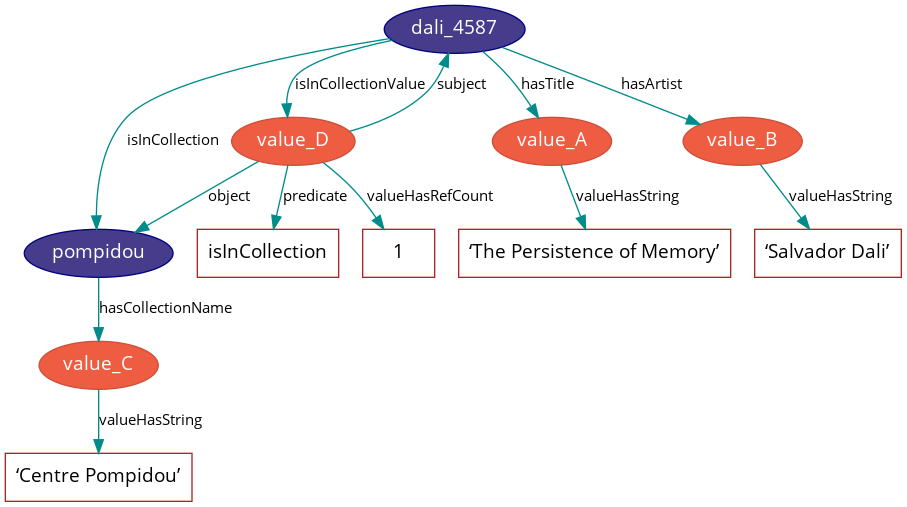

# Knora-base ontology

<br>

Knora has a base ontology, i.e. a data model, with pre-defined basic data types. In addition to this base ontology, each project can create its own data model which is capable to describe the types of items it wishes to store. Project specific ontologies **must** be extensions of the Knora base ontology.

The Knora-base ontology is identified by the IRI `http://www.knora.org/ontology/knora-base`. In our documents it will be identified by the prefix `kb`. The examples in this document are expressed in [Turtle](http://www.w3.org/TR/turtle/) format, and often simplified for the purposes of illustration.

Knowledge of some basics of the [**R**esource **D**escription **F**ramework (RDF)](rdf.md) are presupposed in this document.

<br>

# The Knora Data Model
The Knora-base ontology describes structured value types that can store also metadata of values such as its creation date, viewing permissions etc. The following figure illustrates a possible scenario for a book which has a title and a certain publication date which both have some metadata attached. 



Our book `ex:book2` ist the subject of a triple with the predicate `ex:title` and the object `kb:TextValue`. The metadata of `kb:TextValue` are the title of `ex:book2`, namely `King Lear` which is attached to `kb:TextValue` by the predicate `kb:valueHasString`, as well as the creation date of the value `2015-08-12 13:00` attached by the predicate `kb:valueCreationDate`. Similarly, `ex:book2` ist the subject of a triple with the predicate `ex:pubdate` and the object `kb:DateValue`. The metadata of `kb:DateValue` are a starting publication date with the value `2364669` attached by the predicate`kb:valueHasStartJDN`, an end publication date with the value `2364669` attached by the predicate `kb:valueHasEndJDN`  as well as the creation date with the value `2015-08-12 13:03` attached by the predicate `kb:valueCreationDate`.

<br>

## Projects
In Knora each item of data belongs to some particular project.
The properties each project has to define are summarised in [Knora-admin ontology](knora-admin.md). Ontologies, resources and values are attached to projects by means of the `kb:attachedToProject` property. 

<br>

## Ontologies
Each user-created ontology must be defined as an `owl:Ontology` with the
properties `rdfs:label` and `kb:attachedToProject`:
````
<http://www.knora.org/ontology/example-project> rdf:type owl:Ontology ;

    rdfs:label "Our example project ontology"@en ;

    kb:attachedToProject knora-admin:ExampleProject .
````

<br>

## Resources
All the content produced by a project (e.g. digitised primary source materials or research data) must be stored in objects that belong to subclasses of `kb:Resource`, in order that Knora can query and update that content. Each project using the Knora base ontology must define its own OWL classes, derived from
`kb:Resource`, to represent the types of data it deals with. A subclass of `kb:Resource` may additionally be a subclass of any other class, e.g. an industry-standard class such as `foaf:Person` - this can facilitate searches across projects. Here is an example how a class named `Annotation` could be defined for our example project (prefix `ex`):
````
###  http://www.knora.org/ontology/example-project#Annotation

ex:Annotation rdf:type owl:Class ;

            rdfs:subClassOf kb:Resource ;
            
            rdfs:label "Annotation"@de ,
                       "Annotation"@en ,
                       "Annotation"@fr ;

            rdfs:comment "A class for representing annotations"@en .
````

Resources have properties that point to different parts of the content they contain. For example, a resource representing a book could have a property called `ex:hasAuthor`, pointing to the author of the book. There are two possible kinds of content in a Knora resource: Knora values or links to other resources. Properties that point to Knora values must be subproperties of `kb:hasValue`, and properties that point to other resources must be subproperties of `kb:hasLinkTo`. Either of these two types of properties may also be a subproperty of any other property, e.g. an industry- standard property such as `foaf:name`; as in the case of classes this can facilitate searches across projects. Each property definition must specify the types that its subjects and objects must belong to. A definition of the property `ex:hasAuthor` may look as follows:
````
###  http://www.knora.org/ontology/example-project#hasAuthor

ex:hasAuthor rdf:type owl:ObjectProperty ;

          rdfs:label "Autor"@de ,
                     "author"@en ,
                     "auteur"@fr ;

          rdfs:comment """Specifies the author of a book."""@en ;

          kb:objectClassConstraint kb:Resource ;

          kb:subjectClassConstraint kb:Value ;

          rdfs:subPropertyOf kb:hasValue .
````
A definition of a property `ex:hasLink` in our example ontology may look as follows:
````
###  http://www.knora.org/ontology/example-project#hasLink

ex:hasLink rdf:type owl:ObjectProperty ;

           rdfs:label "hat Link zu"@de ,
                      "has Link to"@en ,
                      "a lien vers"@fr ;

           rdfs:comment "Represents a direct connection between two resources"@en ;

           kb:objectClassConstraint kb:LinkValue ;

           kb:subjectClassConstraint kb:Resource ;
           
           rdfs:subPropertyOf kb:hasLinkTo .
````

Each user-created resource class definition must use [OWL cardinality restrictions](#owl-cardinalities) to specify the properties that resources of that class can have. Thus, a valid definition of our above mentioned class `ex:Annotation` for the example project looks as follows:
````
###  http://www.knora.org/ontology/example-project#Annotation

ex:Annotation rdf:type owl:Class ;

            rdfs:subClassOf kb:Resource ,
                           [ rdf:type owl:Restriction ;
                              owl:onProperty kb:hasComment ;
                              owl:minCardinality "1"^^xsd:nonNegativeInteger
                            ] ,
                            [ rdf:type owl:Restriction ;
                              owl:onProperty kb:isAnnotationOf ;
                              owl:minCardinality "1"^^xsd:nonNegativeInteger
                            ] ,
                            [ rdf:type owl:Restriction ;
                              owl:onProperty kb:isAnnotationOfValue ;
                              owl:minCardinality "1"^^xsd:nonNegativeInteger
                            ] ;
            
            rdfs:label "Annotation"@de ,
                       "Annotation"@en ,
                       "Annotation"@fr ;

            kb:canBeInstantiated true ;

            rdfs:comment "A class for representing annotations"@en .
````

Every resource is required to have an `rdfs:label`. The object of this property is an `xsd:string`, rather than a Knora value. This means that resources are not versioned, only their values are. A user who has modify permission on a resource can change the label of a resource.

A resource can be marked as deleted. Currently, this means that the respective data are not removed, but  Knora solves this by adding the predicate `kb:isDeleted true` to the resource. An optional `kb:deleteComment` may be
added to explain why the resource has been marked as deleted. Deleted resources are normally hidden. They cannot be undeleted, because even though resources are not versioned, it is necessary to be able to find out when a resource was deleted. If desired, a new resource can be created by copying data from a deleted resource.

<br>

### Properties of resources
Properties of resources are summarised in the following list. The numbers given in parentheses after each property are the so-called *cardinalities*. For more information on cardinalities see [here](#owl-cardinalities).
* `kb:creationDate` (1): The time when the resource was created.
* `kb:attachedToUser` (1): The user who owns the resource.
* `kb:attachedToProject` (1): The project that the resource is part of.
* `kb:lastModificationDate` (0–1): A timestamp indicating when the resource or one of its values was last modified. 
* `kb:seqnum` (0–1): The sequence number of the resource, if it is part of an ordered group of resources, such as the pages in a book.
* `kb:isDeleted` (1): Indicates whether the resource has been deleted.
* `kb:deleteDate` (0–1): If the resource has been deleted, indicates when it was deleted.
* `kb:deleteComment` (0–1): If the resource has been deleted, indicates why it was deleted.

<br>

### Representations
It is not practical to store all data in RDF. In particular, RDF is not a good storage medium for binary data such as images. Therefore, Knora stores such data outside the triplestore, in ordinary files. A resource can have metadata about a file attached to it. The technical term for such a resource in Knora is a Representation. For each file, there is a `kb:FileValue` in the triplestore containing metadata about the file. Knora uses [Sipi](../../sipi/documentation/index.md) to store files. The [Knora API](../api-reference/index.md) provides ways to create file values using Knora and Sipi.

A resource that has a file value must belong to one of the subclasses of `kb:Representation`. Its subclasses include:
* `kb:StillImageRepresentation`: A representation containing a still image file.
* `kb:MovingImageRepresentation`: A representation containing a video file.
* `kb:AudioRepresentation`: A representation containing an audio file.
* `kb:DDDrepresentation`: A representation containing a 3D image file.
*  `kb:TextRepresentation`: A representation containing a formatted text file, such as an XML file.
* `kb:DocumentRepresentation`: A representation containing a document such as a PDF file that is not a text file.

These classes can be used directly, but it is often better to define subclasses of them. The latter enables to include metadata about the files being stored. The base class of all these classes is `kb:Representation`, which should not be used directly. It has the following property, which its subclasses override (see [OWL cardinalities](#owl-cardinalities) for more details):
* `kb:hasFileValue` (1): Points to a file value.

There are two ways for a project to define classes for representations. The simpler way is to create a resource class that represents something such as e.g. `ex:Painting` that belongs to a subclass of `kb:Representation`. This is adequate if the class can have only one type of file attached to it. For example, if paintings are represented only by still images, `ex:Painting` could be a subclass of `kb:StillImageRepresentation`:
````
###  http://www.knora.org/ontology/example-project#Painting

ex:Painting rdf:type owl:Class ;

            rdfs:subClassOf kb:StillImageRepresentation ,
                    [ rdf:type owl:Restriction ;
                    owl:onProperty kb:hasStillImageFileValue ;
                    owl:cardinality "1"^^xsd:nonNegativeInteger ; ]

            rdfs:label "Repräsentation (Bild)"@de ,
                        "Representation (image)"@en ,
                        "Répresentation (image)"@fr ;

            rdfs:comment "Represents a file containing still image data"@en .
````

The more flexible approach is to link - by using `kb:hasRepresentation` or a subproperty - each `ex:Painting` to other resources which contain files that represent the painting. Each of these other resources can extend a different subclass of `kb:Representation`. For example, a painting could have a `kb:StillImageRepresentation` as well as a `kb:DDDrepresentation`.
````
###  http://www.knora.org/ontology/example-project#Painting

ex:Painting rdf:type owl:Class ;

**WIE MUSS DAS AUSSEHEN???**
````

<br>

### Standard Resource Classes
The Knora-base ontology provides the following standard subclasses of `kb:Resource` which can be used by any project:
* `kb:Region`: Represents a region of a Representation.
* `kb:Annotation`: Represents an annotation of a resource. The `kb:hasComment` property points to
the text of the annotation, represented as a `kb:TextValue`. 
````
###  http://www.knora.org/ontology/knora-base#Annotation

:Annotation rdf:type owl:Class ;

            rdfs:subClassOf kb:Resource ,
                            [ rdf:type owl:Restriction ;
                              owl:onProperty kb:hasComment ;
                              owl:minCardinality "1"^^xsd:nonNegativeInteger
                            ] ,
                            [ rdf:type owl:Restriction ;
                              owl:onProperty kb:isAnnotationOf ;
                              owl:minCardinality "1"^^xsd:nonNegativeInteger
                            ] ,
                            [ rdf:type owl:Restriction ;
                              owl:onProperty kb:isAnnotationOfValue ;
                              owl:minCardinality "1"^^xsd:nonNegativeInteger
                            ] ;

            rdfs:label "Annotation"@de ,
                       "Annotation"@en ,
                       "Annotation"@fr ;

            rdfs:comment "A generic class for representing annotations"@en .
````
* `kb:LinkObj`: Represents a link that connects two or more resources. A `kb:LinkObj` has a `kb:hasLinkTo` property pointing to each resource that it connects,as well as a `kb:hasLinkToValue` property pointing to a [reification](rdf.md#reification) of each of these direct links. A `kb:LinkObj` is more complex - and hence less convenient and readable - than a simple direct link, but it has the advantage that it can be annotated using an `kb:Annotation`. For improved readability, a project can make its own subclasses of `kb:LinkObj` with specific meanings.
````
###  http://www.knora.org/ontology/knora-base#LinkObj

kb:LinkObj rdf:type owl:Class ;

         rdfs:label "Verknüpfungsobjekt"@de ,
                    "Link Object"@en ,
                    "Objet de lien"@fr ;

         rdfs:subClassOf kb:Resource ,
                         [ rdf:type owl:Restriction ;
                           owl:onProperty kb:hasComment ;
                           owl:minCardinality "0"^^xsd:nonNegativeInteger
                         ] ,
                         [ rdf:type owl:Restriction ;
                           owl:onProperty kb:hasLinkTo ;
                           owl:minCardinality "1"^^xsd:nonNegativeInteger
                         ] ,
                         [ rdf:type owl:Restriction ;
                           owl:onProperty kb:hasLinkToValue ;
                           owl:minCardinality "1"^^xsd:nonNegativeInteger
                         ] ;

         rdfs:comment "Verknüpfung mehrerer Resourcen"@de ,
                      "Represents a generic link object"@en .
````

Furthermore, each project using Knora can define its own subclasses of `kb:Resource`.

<br>

## Values
The Knora base ontology defines a set of OWL classes that are derived from `kb:Value` and represent different types of structured values found in humanities data. This set of classes may not be extended by user-created ontologies.
A value is always part of one particular resource, which points to it using some property derived from `kb:hasValue`. For example, a user-created ontology could specify a Book class with a property `ex:hasSummary` (derived from `kb:hasValue`), and that property could have a `kb:objectClassConstraint` of `kb:TextValue`:
````
###  http://www.knora.org/ontology/example-project#Book

ex:Book rdf:type owl:Class ;
        rdfs:subClassOf kb:Resource ,
                         [ rdf:type owl:Restriction ;
                           owl:onProperty ex:hasSummary ;
                           owl:minCardinality "0"^^xsd:nonNegativeInteger
                         ] ;

        rdfs:label "Buch"@de , 
                   "Book"@en ,
                   "Livre"@fr ; 

        rdfs:comment """This resource class describes a book"""@en .   

##  http://www.knora.org/ontology/example-project#hasSummary

ex:hasSummary rdf:type owl:ObjectProperty ;

            rdfs:label "Zusammenfassung"@de ,
                       "summary"@en ,
                       "resumee"@fr ;

            rdfs:comment """Represents a summary of a resource as a kb:TextValue"""@de ;

            kb:subjectClassConstraint kb:Resource ;

            kb:objectClassConstraint kb:TextValue ;

            rdfs:subPropertyOf kb:hasValue . 
````
This means that the summary of each book is represented as a `kb:TextValue`.

Knora values are versioned. Existing values are not modified. Instead, a new version of an existing value is created. The new version is linked to the old version via the `kb:previousValue` property.

Since each value version has a different IRI, there is no IRI that can be used to cite the latest version of a value. Therefore, the latest version of each value has a separate UUID (**U**niversally **U**nique **Id**entifier), as the object of the property `kb:valueHasUUID`. When a new version of the value is created, this UUID is moved to the new version. This makes it possible to cite the latest version of a value by searching for the UUID.

“Deleting” a value means marking it with `kb:isDeleted`. An optional `kb:deleteComment` may be added to explain why the value has been marked as deleted. Deleted values are normally hidden.

Most types of values are marked as deleted without creating a new version of the value. However, link values must be treated as a special case. Before a `kb:LinkValue` can be marked as deleted,its reference count must be decremented to 0. Therefore, a new version of the `kb:LinkValue` is made, with a reference count of 0, and it is this new version that is marked as deleted.

To simplify the enforcement of ontology constraints, and for consistency with resource updates, no new versions of a deleted value can be made; it is not possible to undelete. Instead, if desired, a new value can be created by copying data from a deleted value.

<br>

### Properties of Value
* `kb:valueCreationDate` (1): The date and time when the value was created.
* `kb:attachedToUser` (1): The user who owns the value.
* `kb:attachedToProject` (0–1): The project that the value is part of. If not specified, defaults to the project of the containing resource. 
* `kb:valueHasString` (1): A human-readable string representation of the value’s contents, which is available to Knora’s full-text search index.
* `kb:valueHasOrder` (0–1): A resource may have several properties of the same type with different values of the same class, and it may be necessary to indicate an order in which these values occur. For example, a book may have several authors which should appear in a defined order. Hence, `kb:valueHasOrder`, when present, points to an integer literal indicating the order of a given value relative to the other values of the same property. These integers will not necessarily start at any particular number, and will not necessarily be consecutive.
* `kb:previousValue` (0–1): The previous version of the value.
* `kb:valueHasUUID` (0–1): The UUID that refers to all versions of the value. Only the latest version of the value has this property. 
* `kb:isDeleted`(1): Indicates whether the value has been deleted. 
* `kb:deleteDate` (0–1): If the value has been deleted, indicates when it was deleted. 
* `kb:deleteComment` (0–1): If the value has been deleted, indicates why it was deleted. 

Each Knora value can grant permissions.

<br>

### Subclasses of Value

**`kb:TextValue`**

`kb:TextValue` represents text, possibly including markup. The text is the object of the `kb:valueHasString` property. A line break is represented as a Unicode line feed character (`U+000A`). The non-printing Unicode character `INFORMATION SEPARATOR TWO (U+001E)` can be used to separate words that are separated only by standoff markup, in order that they are recognised as separate in a full-text search index.

Markup is stored using this property: 
* `kb:valueHasStandoff` (0–n): Points to a standoff markup tag.
* `kb:valueHasMapping` (0–1): Points to the mapping used to create the standoff markup and to convert it back to the original XML. 

A text value can have a specified language: 
* `kb:valueHasLanguage` (0–1): An ISO 639-1 code as string specifying the language of the text.

<br>

**`kb:DateValue`**

Humanities data include many different types of dates. In Knora, a date belongs to a specified calendar, and is always represented as a period with start and end points. If a date concerns a specific day, then the start and the end day coincide. Each of these points has a certain precision (`DAY`, `MONTH`, or `YEAR`). An optional era indicator term (`BCE` / `CE`, or `BC` / `AD`) can be added to the date. When no era is provided the default era `AD` will be considered.

Internally, the start and end points are stored as two Julian Day Numbers. This calendar-independent representation makes it possible to compare and search for dates regardless of the calendar in which they were supplied. 

These are the properties of `kb:DateValue`s:
* `kb:valueHasCalendar` (1): The name of the calendar in which the date should be displayed. Currently, the `GREGORIAN`, `JULIAN` and `ISLAMIC` calendars are supported. 
* `kb:valueHasStartJDN` (1): The Julian Day Number of the start of the period (an `xsd:integer`). 
* `kb:valueHasStartPrecision` (1): The precision of the start of the period. 
* `kb:valueHasEndJDN` (1): The Julian Day Number of the end of the period (an `xsd:integer`). 
* `kb:valueHasEndPrecision` (1): The precision of the end of the period.

<br>

**`kb:IntValue`**

An `kb:IntValue` represents an integer. It has a property `kb:valueHasInteger` (1) which is an `xsd:integer`.

<br>

**`kb:ColorValue`**

A `kb:ColorValue` is a string respresenting a color. It has a property `kb:valueHasColor` (1). The string encodes the color as hexadecimal RGB values:
|Color|HexCode #RGB|
|-----|----|
|red|#FF0000| 
|blue|#0000FF| 
|cyan|#00FFFF| 
|lime|#00FF00| 
|magenta|#FF00FF| 
|yellow|#FFFF00| 

<br>

**`kb:DecimalValue`**

A `kb:DecimalVallue` represents an arbitrary-precision decimal number. It has a property `kb:valueHasDecimal` (1) which is an `xsd:decimal`.

<br>

**`kb:UriValue`**

A `kb:UriValue` represents a non-Knora URI. It has a property `kb:valueHasUri` (1) which is an `xsd:anyURI`.

<br>

**`kb:BooleanValue`**

A `kb:BooleanValue` represents an boolean value. It has a property `kb:valueHasBoolean` (1) which is an `xsd:boolean`.

<br>

**`kb:GeomValue`**

A `kb:GeomValue` represents a geometrical object as a JSON string, using normalized coordinates. It has a property `kb:valueHasGeometry` (1) which is a JSON string. E.g., a rectangle can be defined by:
````
kb:valueHasGeometry "{\"status\":\"active\",\"lineColor\":\"#ff3333\",\"lineWidth\":2,\"points\":[{\"x\":0.08098591549295775,\"y\":0.16741071428571427},{\"x\":0.7394366197183099,\"y\":0.7299107142857143}],\"type\":\"rectangle\",\"original_index\":0}";
````

<br>

**`kb:GeonameValue`**

A `kb:GeonameValue` represents a geolocation by using the identifiers provided at [GeoNames](http://geonames.org). It has a property `kb:valueHasGeonameCode` (1) which is an `xsd:string`.

<br>

**`kb:IntervalValue`**

A `kb:IintervalValue` represents a time interval, with precise start and end times, e.g. relative to the beginning of an audio or video file. It has the following properties:
* `kb:valueHasIntervalStart` (1): This is an `xsd:decimal` representing the start of the interval in seconds.
* `kb:valueHasIntervalEnd` (1): This is an `xsd:decimal` representing the end of the interval in seconds.

<br>

**`kb:ListValue`**

Projects often need to define lists or hierarchies of categories that can be assigned to many different resources. Then, for example, a user interface can provide a drop-down menu to allow the user to assign a category to a resource. The `kb:ListValue` class provides a way to represent these sorts of data structures. It can represent either a flat list or a tree.
A `kb:ListValue` has the property `kb:valueHasListNode` (1) which points to a `kb:ListNode`.

Each `kb:ListNode` can have the following properties:
* `kb:isRootNode` (0–1): Set to true if this is the root node.
* `kb:hasSubListNode` (0–n): Points to the node’s child nodes, if any.
* `kb:hasRootNode` (0–1): Points to the root node of the list. This property is absent if it is the root node (`kb:isRootNode` is `true`).
* `kb:listNodePosition` (0–1): An integer indicating the node’s position in the list of its siblings. This property is absent if it is the root node (`kb:isRootNode` is `true`).
* `kb:listNodeName` (0–1): The node’s human-readable name. This property is absent if it is the root node (`kb:isRootNode` is `true`).

<br>

**`kb:FileValue`**

Knora stores certain kinds of data outside the triplestore, in files (see [Representations](#representations)). Each digital object that is stored outside the triplestore has associated metadata, which are stored in the triplestore in a `kb:FileValue`. The base class `kb:FileValue`, which should not be used directly, has the following properties:
* `kb:internalFilename` (1): The name of the file as stored by Knora.
* `kb:internalMimeType` (1): The MIME type of the file as stored by Knora.
* `kb:originalFilename` (0–1): The original name of the file when it was uploaded to the Knora API server.
* `kb:originalMimeType` (0–1): The original MIME type of the file when it was uploaded to the Knora API server. 
* `kb:isPreview` (0–1): A boolean indicating whether the file is a preview, i.e. a small image representing the contents of the file. A preview is always a `kb:StillImageFileValue`, regardless of the type of the enclosing `kb:Representation`.

The subclasses of `kb:FileValue`, which are intended to be used directly in data, include:
* `kb:StillImageFileValue`: Contains metadata about a still image file.
* `kb:MovingImageFileValue`: Contains metadata about a video file.
* `kb:AudioFileValue`: Contains metadata about an audio file.
* `kb:DDDFileValue`: Contains metadata about a 3D image file.
* `kb:TextFileValue`: Contains metadata about a text file.
* `kb:DocumentFileValue`: Contains metadata about a document (such as PDF) that is not a text file.

Each of these classes contains properties that are specific to the type of file it describes. For example, still image files have dimensions, video files have frame rates, and so on.

`kb:FileValue` objects are versioned like other values,and the actual files stored by Knora are also versioned. 

<br>

**`kb:LinkValue`**

A `kb:LinkValue` is an RDF [reification](rdf.md#reification) containing metadata about a link between two resources. It is therefore a subclass of `rdf:Statement` as well as of `kb:Value`. It has these properties:
* `rdf:subject` (1): The subject is the resource that is the source of the link.
* `rdf:predicate` (1): The predicate is the link property.
* `rdf:object` (1): The object is the resource that is the target of the link.
* `kb:valueHasRefCount` (1): The reference count of the link. This is meaningful when the `kb:LinkValue` describes resource references in [Standoff text markup](#standolinktag). Otherwise, the reference count will always be 1 if the link exists, or 0 if it has been deleted.

For details about how links are created in Knora, see [Links Between Resources](#links-between-resources).

<br>

**`kb:ExternalResValue`**

A `kb:ExternalResValue` represents a resource that is not stored in the RDF triplestore managed by Knora, but instead resides in an external repository managed by some other software. The `kb:ExternalResValue` contains the information that Knora needs in order to access the resource, assuming that a suitable gateway plugin is installed.
* `kb:extResAccessInfo` (1): Names the location of the repository containing the external resource, e.g. its URL.
* `kb:extResId` (1): The repository-specific ID of the external resource.
* `kb:extResProvider` (1): The name of the external provider of the resource.

<br>

## Links between Resources
A link between two resources is expressed as a triple. The subject of this triple is the resource that is the source of the link, the predicate of the triple is a subproperty of `kb:hasLinkTo`, and the triple's object is the resource that is the target of the link. The following example shows how to link objects to a collection via a link property we call `ex:isInCollection` in our example project:
````
ex:isInCollection rdf:type owl:ObjectProperty ;   
      rdfs:subPropertyOf kb:hasLinkTo ;
      kb:subjectClassConstraint ex:Object ; 
      kb:objectClassConstraint ex:Collection .
````
It is useful to store metadata about links. For example, Knora needs to know who owns the link, who has permission to modify it, when it was created, and so on. Such metadata cannot simply describe the link property, because then it would refer to that property in general, not to any particular instance in which that property is used to connect two particular resources. To attach metadata to a specific link in RDF, it is necessary to create an RDF [reification](rdf.md#reification). In the case of links between resources, a reification makes statements about the triple that expresses the link between the resources. Knora uses reifications of type `kb:LinkValue` (described in [kb:LinkValue](#linkvalue) to store metadata about links.

For example, suppose our example project describes paintings that belong to collections. The project can define an ontology as follows:
````
@prefix kb <http://www.knora.org/ontology/knora-base#> . 
@prefix ex: <http://www.knora.org/ontology/paintings#> .

ex:Painting rdf:type owl:Class ; 
      rdfs:subClassOf kb:Resource ,
         [ rdf:type owl:Restriction ;     
               owl:onProperty ex:hasArtist ; 
               owl:cardinality 1 ] ,
         [ rdf:type owl:Restriction ;
               owl:onProperty ex:hasTitle ;
               owl:cardinality 1 ] ;
         [ rdf:type owl:Restriction ;
               owl:onProperty ex:isInCollection ;
               owl:minCardinality 1 ] ;
         [ rdf:type owl:Restriction ;
               owl:onProperty ex:isInCollectionValue ;
               owl:minCardinality 1 ] .

ex:Collection rdf:type owl:Class ;    
      rdfs:subClassOf kb:Resource ,
         [ rdf:type owl:Restriction ; 
               owl:onProperty ex:hasCollectionName ;
              owl:cardinality 1 ] .

ex:hasArtist rdf:type owl:ObjectProperty ;  
      rdfs:label "Name of artist" ; 
      kb:subjectClassConstraint ex:Painting ; 
      kb:objectClassConstraint kb:TextValue .

ex:hasTitle rdf:type owl:ObjectProperty ; 
      rdfs:label "Title of painting" 
      kb:subjectClassConstraint ex:Painting ;
      kb:objectClassConstraint kb:TextValue .

ex:hasCollectionName rdf:type owl:ObjectProperty ;      
      rdfs:label "Name of collection" ;   
      kb:subjectClassConstraint ex:Collection ;
      kb:objectClassConstraint kb:TextValue .
````
To link paintings to this collection it is necessary to add a property to the ontology, that points from a painting to the collection it belongs to. We call this link property `ex:isInCollection` which has to be a subproperty of `kb:hasLinkTo`:
````
ex:isInCollection rdf:type owl:ObjectProperty ; 
      rdfs:subPropertyOf kb:hasLinkTo ;
      kb:subjectClassConstraint ex:Painting ;
      kb:objectClassConstraint ex:Collection .
````
We must then add a “link value property”, which will point from a painting to a `kb:LinkValue`. It will contain metadata about the link between the property and the collection. The link value specifies the creator of the link, the date when it was created, and the permissions that determine who can view or modify it. The name of the link value property is constructed using a simple naming convention: the word `Value` is appended to the name of the link property. In this case, since our link property is called `ex:isInCollection`, the link value property must be called `ex:isInCollectionValue`. Remember that every link value property must be a subproperty of `kb:hasLinkToValue`. Thus, we have:
````
ex:isInCollectionValue rdf:type owl:ObjectProperty ; 
      rdfs:subPropertyOf kb:hasLinkToValue ; 
      kb:subjectClassConstraint ex:Painting ;
      kb:objectClassConstraint kb:LinkValue .
````
Based on this ontology some RDF data describing a painting and a collection can be added:
````
@prefix ex <http://www.knora.org/ontology/paintings#> . 
@prefix data <http://www.knora.org/ontology/paintings/data#> .

data:dali_4587 rdf:type ex:Painting ; 
      ex:hasTitle data:value_A ; 
      ex:hasArtist data:value_B .

data:value_A rdf:type kb:TextValue ; 
      kb:valueHasString "The Persistence of Memory" .

data:value_B rdf:type kb:TextValue ; 
      kb:valueHasString "Salvador Dali" .

data:pompidou rdf:type ex:Collection ;    
      ex:hasCollectionName data:value_C .

data:value_C rdf:type kb:TextValue ; 
      kb:valueHasString "Centre Pompidou, Paris" .
````
We can then state that the painting is in the collection:
````
data:dali_4587 ex:isInCollection data:pompidou ; 
      ex:isinCollectionValue data:value_D .

data:value_D rdf:type kb:LinkValue ; 
      rdf:subject data:dali_4587 ; 
      rdf:predicate ex:isInCollection ;
      rdf:object data:pompidou ;
      kb:valueHasRefCount 1 .
````
This creates a link (`ex:isInCollection`) between the painting and the collection, along with a reification containing metadata about the link. We can visualise the result as the following graph:



Knora allows a user to see a link if the requesting user has permission to see the source and target resources as well as the `kb:LinkValue`.

<br>

## Text with Standoff Markup
Knora is designed to be able to store text with markup, which can indicate formatting and structure, as well as the complex observations involved in transcribing handwritten manuscripts. One popular way of representing text in the humanities is to encode it in XML using the Text Encoding Initiative [TEI](http://www.tei-c.org/release/doc/tei-p5-doc/en/html/index.html) guidelines. In Knora, a TEI/XML document can be stored as a file with attached metadata, but this is not recommended, because it does not allow Knora to perform searches across multiple documents.

The recommended way to store text with markup in Knora is to use Knora’s built-in support for “standoff” markup, which is stored separately from the text. This has some advantages over embedded markup such as XML. While XML requires markup to have a hierarchical structure, and does not allow overlapping tags, the use of so-called standoff nodes does not have these limitations. A standoff tag can be attached to any substring in the text by giving its start and end positions. Unlike in corpus linguistics, we do not use any tokenisation resulting in a form of predefined segmentation, which would limit the user’s ability to freely annotate any ranges in the text.

For example, suppose we have the following text: 

This *sentence* ***has overlapping***  **visual** attributes.

This would require just two standoff tags: (`italic, start=5, end=29)` and (`bold, start=14, end=36`) .

Moreover, standoff makes it possible to mark up the same text in different, possibly incompatible ways, allowing for different interpretations without making redundant copies of the text. In the Knora base ontology, any text value can have standoff tags.

By representing standoff as RDF triples, Knora makes markup searchable across multiple text documents in a repository. For example, if a repository contains documents in which references to persons are indicated in standoff, it is straightforward to find all the documents mentioning a particular person. Knora’s standoff support is intended to make it possible to convert documents with embedded, hierarchical markup, such as TEI/XML, into RDF standoff and back again, with no data loss, thus bringing the benefits of RDF to existing TEI-encoded documents.

In the Knora base ontology, a `kb:TextValue` can have one or more standoff tags. Each standoff tag indicates the start and end positions of a substring in the text that has a particular attribute. The OWL class `kb:StandoffTag`, which is the base class of all standoff node classes, has these properties:
* `kb:standoffTagHasStart` (1): The index of the first character in the text that has the attribute. 
* `kb:standoffTagHasEnd` (1): The index of the last character in the text that has the attribute, plus 1. 
* `kb:standoffTagHasUUID` (1): A UUID identifying this instance and those corresponding to it in later versions of the `kb:TextValue` it belongs to. The UUID is a means to maintain a reference to a particular range of a text also when new versions are made and standoff tag IRIs change.
* `kb:standoffTagHasOriginalXMLID` (0–1): The original ID of the XML element that the standoff tag represents, if any.
* `kb:standoffTagHasStartIndex` (1): The start index of the standoff tag. Start indexes are numbered from 0 within the context of a particular text. When several standoff tags share the same start position, they can be nested correctly with this information when transforming them to XML.
* `kb:standoffTagHasEndIndex` (1): The end index of the standoff tag. Start indexes are numbered from 0 within the context of a particular text. When several standoff tags share the same end position, they can be nested correctly with this information when transforming them to XML.
* `kb:standoffTagHasStartParent` (0–1): Points to the parent standoff tag. This corresponds to the original nesting of tags in XML. If a standoff tag has no parent, it represents the XML root element. If the original XML element is a [CLIX](http://conferences.idealliance.org/extreme/html/2004/DeRose01/EML2004DeRose01.html#t6) tag, i.e. 
valid XML for overlapping markup, it represents the start of a virtual (non syntactical) hierarchy.
* `kb:standoffTagHasEndParent` (0–1): Points to the parent standoff tag if the original XML element is a CLIX tag and represents the end of a virtual (non syntactical) hierarchy.

Thus, the definition of `kb:StandoffTag` is as follows:
````
###  http://www.knora.org/ontology/knora-base#StandoffTag

kb:StandoffTag rdf:type owl:Class ;

          rdfs:subClassOf [ rdf:type owl:Restriction ;
                            owl:onProperty kb:standoffTagHasStart ;
                            owl:cardinality "1"^^xsd:nonNegativeInteger
                          ] ,
                          [ rdf:type owl:Restriction ;
                            owl:onProperty kb:standoffTagHasEnd ;
                            owl:cardinality "1"^^xsd:nonNegativeInteger
                          ] ,
                          [ rdf:type owl:Restriction ;
                            owl:onProperty kb:standoffTagHasUUID ;
                            owl:cardinality "1"^^xsd:nonNegativeInteger
                          ],
                          [ rdf:type owl:Restriction ;
                            owl:onProperty kb:standoffTagHasOriginalXMLID ;
                            owl:maxCardinality "1"^^xsd:nonNegativeInteger
                          ] ,
                          [ rdf:type owl:Restriction ;
                            owl:onProperty kb:standoffTagHasStartIndex ;
                            owl:cardinality "1"^^xsd:nonNegativeInteger
                          ],
                          [ rdf:type owl:Restriction ;
                            owl:onProperty kb:standoffTagHasEndIndex ;
                            owl:maxCardinality "1"^^xsd:nonNegativeInteger
                          ],
                          [ rdf:type owl:Restriction ;
                            owl:onProperty kb:standoffTagHasStartParent ;
                            owl:maxCardinality "1"^^xsd:nonNegativeInteger
                          ] ,
                          [ rdf:type owl:Restriction ;
                            owl:onProperty kb:standoffTagHasEndParent ;
                            owl:maxCardinality "1"^^xsd:nonNegativeInteger
                          ] ,
                          [ rdf:type owl:Restriction ;
                            owl:onProperty kb:standoffParentClassConstraint;
                            owl:maxCardinality "1"^^xsd:nonNegativeInteger
                          ] ;

          rdfs:comment "Represents a standoff markup tag"@en .
````

The `kb:StandoffTag` class is not used directly in RDF data; instead, its subclasses are used. A few subclasses are currently provided in an ontology which extends the Knora-base ontology called  `standoff-onto.ttl` (prefix `standoff`), and more will be added to support TEI semantics. Projects are able to define their own custom standoff tag classes  which have to be either direct subclasses of `kb:StandoffTag` or one of the standoff data type classes or subclasses of one of the standoff classes defined in `standoff-onto.ttl`. For example, markup of a header of level 1 is defined in `standoff-onto.ttl` as follows:
````
###  http://www.knora.org/ontology/standoff#StandoffStructuralTag

standoff:StandoffStructuralTag rdf:type owl:Class ;

               rdfs:subClassOf kb:StandoffTag ;

               rdfs:comment "Represents structural markup information in a TextValue"@en .

###  http://www.knora.org/ontology/standoff#StandoffHeader1Tag

standoff:StandoffHeader1Tag rdf:type owl:Class ;

                rdfs:subClassOf standoff:StandoffStructuralTag ;

                rdfs:comment "Represents a header of level 1 in a TextValue"@en .
````

<br>

### Subclasses of StandoffTag
**`STANDOFF DATA TYPE TAGS`**

Standoff data type tags associate data in some Knora value type with a substring in a text. They are subclasses of `kb:ValueBase` classes.
* `kb:StandoffLinkTag`: Indicates that a substring refers to another `kb:Resource`.
* `kb:StandoffInternalReferenceTag`: Indicates that a substring refers to another standoff tag in the same text value.
* `kb:StandoffUriTag`: Indicates that a substring is associated with a URI,which is stored in the same form that is used for `kb:UriValue`.
* `kb:StandoffDateTag`: Indicates that a substring represents a date, which is stored in the same form that is used for `kb:DateValue`.
* `kb:StandoffColorTag`: Indicates that a substring represents a color, which is stored in the same form that is used for `kb:ColorValue`.
* `kb:StandoffIntegerTag`: Indicates that a substring represents an integer,which is stored in the same form that is used for `kb:IntegerValue`.
* `kb:StandoffDecimalTag`: Indicates that a substring represents a number with fractions, which is stored in the same form that is used for `kb:DecimalValue`.
* `kb:StandoffIntervalTag`: Indicates that a substring represents an interval, which is stored in the same form that is used for `kb:IntervalValue`.
* `kb:StandoffBooleanTag`: Indicates that a substring represents a Boolean, which is stored in the same form that is used for `kb:BooleanValue`.

<br>

**`kb:StandoffLinkTag`**

A `kb:StandoffLinkTag` indicates that a substring is associated with a Knora resource. For example, if a repository contains resources representing persons, a text could be marked up so that each time a person’s name is mentioned, a `kb:StandoffLinkTag` connects the name to the Knora resource describing that person. `kb:StandoffLinkTag` has the property 
`kb:standoffTagHasLink` (1) which gives the IRI of the resource that is referred to. Since direct links are easier and more efficient to query than indirect links, Knora automatically creates a direct link between the containing resource and the target resource, along with an RDF reification describing the link, as discussed in [Links Between Resources](#links-between-resources) when a text value contains a resource reference in its standoff nodes. In this case, the link property is always `kb:hasStandoffLinkTo`, and the link value property pointing to the `kb:LinkValue` is always
`kb:hasStandoffLinkToValue`. 

Knora automatically updates direct links and reifications for standoff resource references when text values are updated. To do this, it keeps track of the number of text values in each resource that contain at least one standoff reference to a given target resource. It stores this number as the reference count of the `kb:LinkValue` describing the direct link. Each time this number changes, it makes a new version of the `kb:LinkValue`, with an updated reference count. When the reference count reaches zero, it removes the direct link and makes a new version of the `kb:LinkValue`, marked with `kb:isDeleted`.
For example, if `data:R1` is a resource with a text value in which the resource `data:R2` is referenced,the repository could contain the following triples:
````
data:R1 ex:hasComment data:V1 .

data:V1 rdf:type kb:TextValue ; 
      kb:valueHasString "This link is internal." ;
      kb:valueHasStandoff data:SO1 .

data:SO1 rdf:type kb:StandoffLinkTag ; 
      kb:standoffTagHasStart: 5 ; 
      kb:standoffTagHasEnd: 9 ; 
      kb:standoffTagHasLink data:R2 .

data:R1 kb:hasStandoffLinkTo data:R2 . 
data:R1 kb:hasStandoffLinkToValue data:LV1 .

data:LV1 rdf:type kb:LinkValue ; 
      rdf:subject data:R1 ;
      rdf:predicate kb:hasStandoffLinkTo ; 
      rdf:object data:R2 ; 
      kb:valueHasRefCount 1 .
````
The result can be visualized like this:


Link values created automatically for resource references in standoff are visible to all users, and the creator of these link values is always `knora-admin:SystemUser` (see [Users and Groups](knora-admin.md#users-and-groups)). The Knora API server allows a user to see a standoff link if the user has permission to see the source as well as the target resource.

<br>

### Internal Links in a TextValue
Internal links in a `kb:TextValue` are used to point from one place in a document to another place in the same document. They are represented using the data type standoff class `kb:StandoffInternalReferenceTag` or a subclass of it. It has the property `kb:standoffTagHasInternalReference` (1) which points to a `kb:StandoffTag` that belongs to the same `kb:TextValue`. It has an
`kb:objectClassConstraint` of `kb:StandoffTag`. For more information see [here](https://docs.knora.org/paradox/03-apis/api-v1/xml-to-standoff-mapping.html#internal-references-in-an-xml-document).

<br>

### Mapping to create Standoff from XML
A mapping allows for the conversion of an XML document to RDF-standoff and back. A mapping defines one-to-one relations between XML elements and attributes and standoff classes and properties (see [XML to Standoff Mapping](https://docs.knora.org/paradox/03-apis/api-v2/xml-to-standoff-mapping.html)).

A mapping is represented by a `kb:XMLToStandoffMapping` which contains one or more `kb:MappingElement`s. A `kb:MappingElement` maps an XML element including its attributes to a standoff class and standoff properties. It has the following properties:
* `kb:mappingHasXMLTagname` (1): The name of the XML element that is mapped to a standoff class.
* `kb:mappingHasXMLNamespace` (1): The XML namespace of the XML element that is mapped to a standoff class. If no namespace is given, `noNamespace` is used. 
* `kb:mappingHasXMLClass` (1): The name of the class of the XML element. If it has no class, `noClass` is used.
* `kb:mappingHasStandoffClass` (1): The standoff class the XML element is mapped to.
* `kb:mappingHasXMLAttribute` (0–n): Maps XML attributes to standoff properties using `kb:MappingXMLAttribute`.
* `kb:mappingHasStandoffDataTypeClass` (0–1): Indicates the standoff data type class of the standoff class the XML element is mapped to.
* `kb:mappingElementRequiresSeparator` (0–1): Indicates if there should be an invisible word separator inserted after the XML element in the RDF-standoff representation. Once the markup is stripped, text segments that belonged to different elements may be concatenated.

A `kb:MappingXMLAttribute` has the following properties:
* `kb:mappingHasXMLAttributename`: The name of the XML attribute that is mapped to a standoff property.
* `kb:mappingHasXMLNamespace`: The namespace of the XML attribute that is mapped to a standoff property. If no namespace is given, `noNamespace` is used.
* `kb:mappingHasStandoffProperty`: The standoff property the XML attribute is mapped to.

Knora includes a standard mapping used by the SALSAH GUI. It has the IRI http://rdfh.ch/standoff/mappings/StandardMapping and defines mappings for a few elements used to write texts with simple markup.

<br>

### Standoff in Digital Editions
Knora’s standoff is designed to make it possible to convert XML documents to standoff and back. One application for this feature is an editing workflow in which an editor works in an XML editor, and the resulting XML documents are converted to standoff and stored in Knora, where they can be searched and annotated.

If an editor wants to correct text that has been imported from XML into standoff, the text can be exported as XML, edited, and imported again. To preserve annotations on standoff tags across edits, each tag can automatically be given a UUID. In a future version of the Knora-base ontology, it will be possible to create annotations that point to UUIDs rather than to IRIs. When a text is exported to XML, the UUIDs can be included in the XML. When the edited XML is imported again, it can be converted to new standoff tags with the same UUIDs. Annotations that applied to standoff tags in the previous version of the text will therefore also apply to equivalent tags in the new version.

When text is converted from XML into standoff, tags are also given indexes, which are numbered from 0 within the context of a particular text. This makes it possible to order tags that share the same position, and to preserve the hierarchy of the original XML document. An ordinary, hierarchical XML tag is converted to a standoff tag that has one index, as well as the index of its parent tag, if any. The Knora base ontology also supports non-hierarchical markup such as [CLIX](http://conferences.idealliance.org/extreme/html/2004/DeRose01/EML2004DeRose01.html#t6), which enables overlapping markup to be represented in XML. When non-hierarchical markup is converted to standoff, both the start position and the end position of the standoff tag have indexes and parent indexes.

To support these features, a standoff tag can have these additional properties: 
* `kb:standoffTagHasStartIndex` (0–1): The index of the start position. 
* `kb:standoffTagHasEndIndex`: The index of the end position, if this is a non-hierarchical tag. 
* `kb:standoffTagHasStartParent` (0–1): The IRI of the tag, if any, that contains the start position. 
* `kb:standoffTagHasEndParent` (0–1): The IRI of the tag, if any, that contains the end position, if this is a non-hierarchical tag.
* `kb:standoffTagHasUUID` (0–1): A UUID that can be used to annotate a standoff tag that may be present in different versions of a text, or in different layers of a text (such as a diplomatic transcription and an edited critical text).

<br>

### Querying standoff in SPARQL
A future version of Knora will provide an API for querying standoff markup. In the meantime, it is possible to query it directly in SPARQL. For example, here is a SPARQL query (using RDFS inference) that finds all the text values texts that have a standoff date tag referring to Christmas Eve 2016 (Julian Date Number 2457747), contained in a `standoff:StandoffItalicTag`:
````
PREFIX kb: <http://www.knora.org/ontology/knora-base#>
PREFIX standoff: <http://www.knora.org/ontology/standoff#> 

select * where {
    ?standoffTag a kb:StandoffDateTag . 
    
    ?standoffTag kb:valueHasStartJDN ?dateStart .
    ?standoffTag kb:valueHasEndJDN ?dateEnd . 
    
    FILTER (2457747 <= ?dateEnd && 2457747 >= ?dateStart)

    ?standoffTag kb:standoffTagHasStartParent ?parent . 
    ?parent a standoff:StandoffItalicTag .

    ?textValue kb:valueHasStandoff ?standoffTag . 
    ?textValue kb:valueHasString ?string .

    ?standoffTag kb:standoffTagHasStart ?startPos .
    ?standoffTag kb:standoffTagHasEnd ?endPos . 
}
````

<br>

## Consistency checking
Knora tries to enforce repository consistency by checking constraints that are specified in the Knora-base ontology and in user-created ontologies. Three types of consistency rules are enforced:
* Cardinalities in OWL class definitions must be satisfied.
* Constraints on the types of the subjects and objects of OWL object properties must be satisfied.
* A datatype property may not have an empty string as an object.

The implementation of consistency checking is partly triplestore-dependent; Knora may be able to provide stricter checks with some triplestores than with others.

<br>

## OWL cardinalities
As noted in [Resources](#resources), each subclass of Resource must use OWL cardinality restrictions to specify the properties it can have. More specifically, a resource is allowed to have a property that is a subproperty of `kb:hasValue` or `kb:hasLinkTo` only if the resource’s class has some cardinality for that property. Similarly, a value is allowed to have a subproperty of `kb:valueHas` only if the value’s class has some cardinality for that property. Knora supports, and attempts to enforce, the following cardinality constraints:
* `owl:cardinality 1`: A resource of this class must have exactly one instance of the specified property.
* `owl:minCardinality 1`: A resource of this class must have at least one instance of the specified property.
* `owl:maxCardinality 1`: A resource of this class may have zero or one instance of the specified property.
* `owl:minCardinality 0`: A resource of this class may have zero or more instances of the specified property.

Knora requires cardinalities to be defined using blank nodes, as in the following example from Knora-base:
````
kb:Representation rdf:type owl:Class ; 
      rdfs:subClassOf kb:Resource ,
          [ rdf:type owl:Restriction ;
            owl:onProperty kb:hasFileValue ;
            owl:minCardinality "1"^^xsd:nonNegativeInteger ] .

kb:StillImageRepresentation rdf:type owl:Class ; 
      rdfs:subClassOf kb:Representation ,
          [ rdf:type owl:Restriction ;
            owl:onProperty kb:hasStillImageFileValue ; 
            owl:minCardinality "1"^^xsd:nonNegativeInteger ] .
````
The cardinality of a link property must be the same as the cardinality of the corresponding link value property.

Each `owl:Restriction` may have the predicate `salsah-gui:guiOrder` to indicate the order in which properties should be displayed in a GUI.

A resource class inherits cardinalities from its superclasses. This follows from the rules of [RDFS](http://www.w3.org/TR/2014/REC-rdf-schema-20140225/) inference. Also, in Knora, cardinalities in the subclass can override cardinalities that would otherwise be inherited from the superclass. Specifically, if a superclass has a cardinality on a property P, and a subclass has a cardinality on a subproperty of P, the subclass’s cardinality overrides the superclass’s cardinality. In the example above, `kb:hasStillImageFileValue` is a subproperty of `kb:hasFileValue`. Therefore, the cardinality on `kb:hasStillImageFileValue` overrides (i.e. replaces) the one on `kb:hasFileValue`.

Note that, unlike cardinalities, predicates of properties are not inherited. If `ex:foo rdfs:subPropertyOf ex:bar`, this does not mean that `ex:foo` inherits anything from
`ex:bar`. Any predicates of `ex:foo` that are also needed by `ex:bar` must be defined explicitly on `ex:bar`. This design decision was made because property predicate inheritance is not provided by RDFS inference, and would make it more difficult to check the correctness of ontologies, while providing little practical benefit.
For more information about OWL cardinalities, see the [OWL 2 Primer](http://www.w3.org/TR/2012/REC-owl2-primer-20121211/) or [RDF](rdf.md#restrictions).

## Constraints on the types of property subjects and objects
When a user-created ontology defines a property, it must indicate the types that are allowed as objects (and, if possible, as subjects) of the property. This is done using the following Knora-specific properties:
* `kb:subjectClassConstraint`: Specifies the class that subjects of the property must belong to. This constraint is recommended but not required. Knora will attempt to enforce this constraint.
* `kb:objectClassConstraint`: Specifies the class that objects of the property must belong to. Every subproperty of `kb:hasValue` or a `kb:hasLinkTo` - i.e. every property of a resource that points to a `kb:Value` or to another resource - is required to have this constraint, because Knora relies on it to know what type of object to expect for the property. Knora will attempt to enforce this constraint.
* `kb:objectDatatypeConstraint`: If the property is a datatype property, specifies the type of literals that can be objects of the property. Knora will not attempt to enforce this constraint, but it is useful for documentation purposes.

Note that it is possible for a subproperty to have a more restrictive contraint than its base property, by specifing a subject or object class that is a subclass of the one specified in the base property. However, it is not possible for the subproperty to make the base property’s constraint less restrictive.

<br>

### Consistency constraint example
A user-created ontology could define consistency constraints as in this simplified example:
````
ex:book rdf:type owl:Class ; 
      rdfs:subClassOf kb:Resource ,
            [ rdf:type owl:Restriction ;
              owl:onProperty ex:hasTitle ;
              owl:cardinality "1"^^xsd:nonNegativeInteger ] ,
            [ rdf:type owl:Restriction ;
              owl:onProperty ex:hasAuthor ;
              owl:minCardinality "0"^^xsd:nonNegativeInteger ] .

ex:hasTitle rdf:type owl:ObjectProperty ; 
      kb:subjectClassConstraint ex:book ; 
      kb:objectClassConstraint kb:TextValue .

ex:hasAuthor rdf:type owl:ObjectProperty ; 
      kb:subjectClassConstraint ex:book ; 
      kb:objectClassConstraint kb:TextValue .
````

<br>

# Summary of restrictions on user-created ontologies
An ontology can refer to a Knora ontology in another project only if the other ontology is built-in or shared.

<br>

## Restrictions on Classes
* Each class must be a subclass of either `kb:Resource` or `kb:StandoffTag`, but not both of them. Note that this forbids user-created subclasses of `kb:Value`!
* All the cardinalities that a class defines directly (i.e. does not inherit from `kb:Resource`) must be on properties that are defined in the triplestore. 
* Within the cardinalities of a class, there must be a link value property for each link property and vice versa.
* The cardinality of a link property must be the same as the cardinality of the corresponding link value property.
* A cardinality on a property with a boolean value must be `owl:cardinality 1` or `owl:maxCardinality 1`.
* Each class must be a subclass of all the classes that are subject class constraints of the properties in its cardinalities.
* If it’s a resource class, all its directly defined cardinalities must be on Knora resource properties (subproperties of `kb:hasValue` or `kb:hasLinkTo`), and all its base classes with Knora IRIs must also be resource classes. A cardinality on `kb:resourceProperty` or `kb:hasValue` is forbidden. It must also have an `rdfs:label`.
* If it’s a standoff class, none of its cardinalities may be on Knora resource properties, and all its base classes with Knora IRIs must also be standoff classes.
* A class cannot have a cardinality on property P as well as a cardinality on a subproperty of P.

<br>

## Restrictions on properties
* The property’s subject class constraint, if provided, must be a subclass of `kb:Resource` or `kb:StandoffTag`, and must be a subclass of the subject class constraints of all its base properties.
* Its object class constraint, if provided, must be a subclass of the object class constraints of all its base properties.
* If the property is a Knora resource property, it must have an object class constraint and an `rdfs:label`.
* It can’t be a subproperty of both `kb:hasValue` and `kb:hasLinkTo`. 
* It can’t be a subproperty of `kb:hasFileValue`.
* Each of its base properties that has a Knora IRI must also be a Knora resource property.