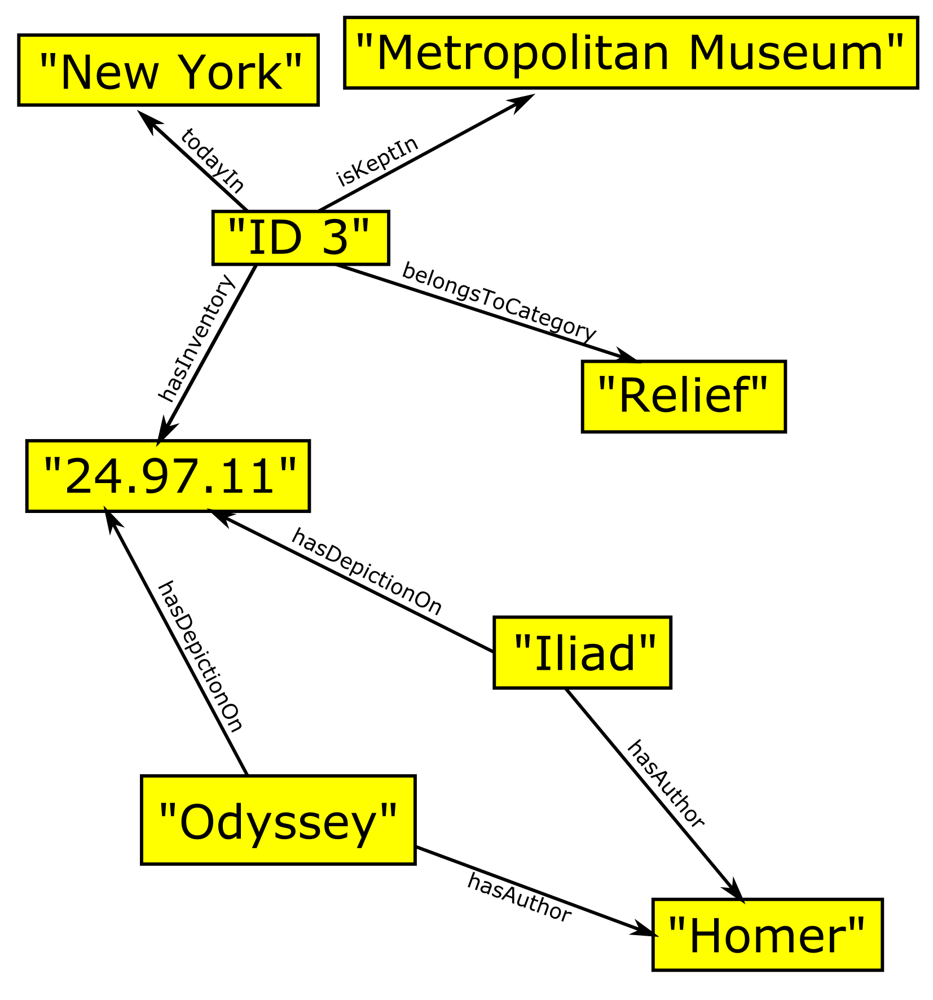
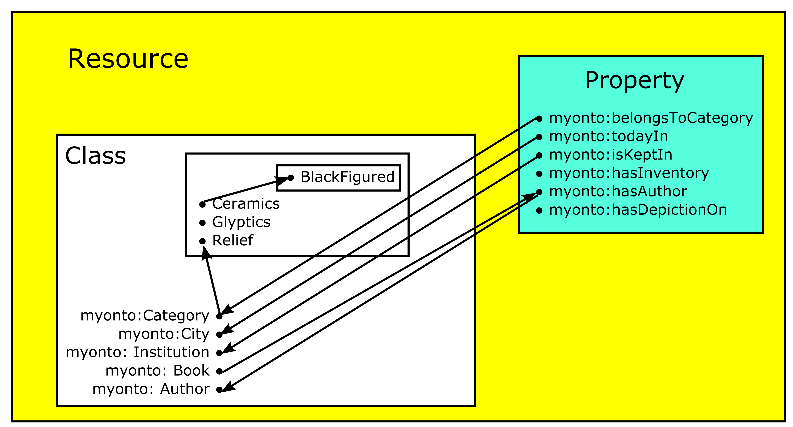

# Resource Description Framework (RDF) basics

The Resource Description Framework (RDF) is the basic representation language and foundation of the Semantic Web. It addresses the fundamental issue of managing distributed data. All things in the world are referred to as ***resources***. Resources can be anything: documents, people, physical objects as well as abstract concepts. The Resource Description Framework (RDF) is the framework for expressing information about such resources. It is useful if information on the Web is not only displayed, but needs to be processed by applications. 

The following introduction to RDF draws heavily on the book of **Dean Allemang & James Hendler, Semantic Web for the Working Ontologist. Effective Modeling in RDFS and OWL, Second Edition, 2011, 27–50** which we warmly recommend for reading. Further information can be found in the [RDF 1.1 Primer](https://www.w3.org/TR/2014/NOTE-rdf11-primer-20140624/).

<br>

## A note about the examples in this document
It was aimed for to explain all following language features by using only one exemplary project. The setting of the chosen project is the following: It is about archaeological objects stemming from different findspots - known and unknown - and kept in different institutions around the world today. These objects show depictions of mythological scenes that illustrate episodes known from ancient literature, e.g. the Iliad or the Odyssey of Homer, or reflect thoughts of various ancient philosophers about the nature of our world and all creatures living therein. For some of these objects other data and documents exist on the Web, e.g. entries in museum databases, and we may possess low or high resolution images of them. Furthermore, the findspots - if known - can be identified unambigously by reference to geographical databases, e.g. GeoNames. 

<br>

If data are available in tabular form, the rows represent the items we intend to describe and each column represents some property of these items. The cells in the table then denote particular values for these properties. Table 1 shows a small excerpt of such a table from our exemplary project.

|ID|Category|City|Institution|InventoryNr.|
|-----|:----:|:----:|:----:|---|
|1|Ceramics|Boston|Museum of Fine Arts|28.46| 
|2|Glyptics|London|British Museum|2717|
|3|Relief|New York|Metropolitan Museum|24.97.11|


In RDF, each of these cells has to be represented with three values which are called ***triples***: a global reference for the row, a global reference for the column, and the value in the cell itself. The identifier for the row is the **subject** of the triple, the identifier for the column the **predicate** of the triple, and the value in the cell the **object** of the triple. 

There are three types of RDF data that can occur in triples: **I**nternational **R**esource **I**dentifiers (**IRI**s) / **U**niversal **R**esource **I**dentifiers (**URI**s), **literals** and **blank nodes**.

A triple now describes the relationship between two resources which are the subject and the object of the triple. The predicate represents the nature of the relationship between subject and object. The relationship is directional - the predicate always points from the subject to the object - and is called a **property**. 

Table 2 shows all the triples of the data in Table 1.
|Subject|Predicate|Object|
|-----|:----:|---|
|ID 1|belongsToCategory|Ceramics|
|ID 1|todayIn|Boston|
|ID 1|isKeptIn|Museum of Fine Arts|
|ID 1|hasInventory|28.46|
|ID 2|belongsToCategory|Glyptics|
|ID 2|todayIn|London|
|ID 2|isKeptIn|British Museum|
|ID 2|hasInventory|2717|
|ID 3|belongsToCategory|Relief|
|ID 3|todayIn|New York|
|ID 3|isKeptIn|Metropolitan Museum|
|ID 3|hasInventory|24.97.11|

Often, the same resource, e.g. a person, is referenced in multiple triples. When more than one triple refers to the same thing, it is more useful to view the triples in a ***directed graph*** where each triple is depicted by nodes and arcs: the subjects and objects of the triples are the nodes while the predicates denote the arcs with the predicate as label on the arc:


Furthermore, if the subject or object is a URI/IRI or a blank node, it is depicted within an ellipse, if it is a literal value, however, within a rectangle. 

The graph display of the triples in Table 2 then looks as follows:
 

Let's assume we possess the information in Table 3 from another source which we intend to merge with our data presented in Table 1.
|Work|Author|Depiction|
|-----|:----:|---|
|Iliad|Homer|24.97.11|
|Odyssey|Homer|24.97.11|
This provides us with the following triples in Table 4:
|Subject|Predicate|Object|
|-----|:----:|---|
|Iliad|hasAuthor|Homer|
|Odyssey|hasAuthor|Homer|
|Iliad|hasDepictionOn|24.97.11|
|Odyssey|hasDepictionOn|24.97.11|
The graph display of the triples in Table 2 concerning ID 3 and of the triples in Table 4 looks as follows:

Since we now look at one specific example, namely "ID 3", all the values are literals and hence depicted in yellow rectangles.

<br>

## Namespaces, Uniform Resource Identifiers (URIs) and International Resource Identifiers (IRIs)
If we intend to merge information from different sources, an essential question is whether a node in one graph is *the same node* as a node in another graph. RDF solves this issue through use of [**U**niform **R**esource **I**dentifiers](https://tools.ietf.org/html/rfc3986) (URIs) or [**I**nternational **R**esource **I**dentifiers](https://tools.ietf.org/html/rfc3987) (IRIs). Our well known web addresses, the URLs, are just a special case of URIs and IRIs. An International Resource Identifier is the internationalised form of a URI. IRIs extend the allowed characters in URIs from a subset of the ASCII character set to almost all characters of the Universal Code Character Set (Unicode / ISO 10646). 

The syntax of the URI/IRI allows to deference it, i.e. to use all the information in the URI/IRI such as server name, protocol, port number, file name etc. to locate a file or a location on the Web. The possibility of dereferencing enables participation in a global Web infrastructure.

URIs and IRIs are painful to write out in detail when expressing models. Hence, it is common to use an abbreviation scheme. Then a URI/IRI has two parts: a ***namespace*** and an ***identifier*** with a colon in between. The representation for the identifier *United Kingdom* in the namespace *geonames* is `geonames:UnitedKingdom`.

URIs/IRIs may not contain embedded spaces. Hence, the so-called InterCap convention is followed: names that consist of multiple words are transformed to identifiers without spaces by capitalizing each word: "part of" becomes `partOf`, "Measure for Measure" `MeasureForMeasure`, and so on. The selection of namespaces is unrestricted. However, it is common practice to refer to related identifiers in a single namespace. Following the above example all geographical information would be placed into the suggestive namespace *geonames*. These names correspond to fully qualified URIs - *geonames* stands for material in the geographical database [GeoNames](https://www.geonames.org/). 

Using URIs/IRIs as standard for global identifiers enables for a worldwide reference and thus, two peolpe anywhere in the world to refer to the same thing unequivocally. This property allows for specifying certain terms by a standard organization such as W3C. [W3C](https://www.w3.org/) standards provide definitions for terms such as e.g. `type`, `Class`, `subClassOf` which are intended to apply ***globally*** across the Semantic Web.

W3C has defined a number of standard namespaces for use with Web technologies. The most important are:
* `xsd:` Indicates identifiers for XML schema definition. The global IRI for the *xsd* namespace is [http://www.w3.org/2001/XMLSchema#](http://www.w3.org/2001/XMLSchema#).
* `xslns:`  Indicates identifiers for XML namespaces. The global IRI for the *xslns* namespace is [https://www.w3.org/XML/1998/namespace](https://www.w3.org/XML/1998/namespace).
* `rdf:` Indicates identifiers used in RDF. The global IRI for the *rdf* namespace is [http://www.w3.org/1999/02/22-rdf-syntax-ns#](http://www.w3.org/1999/02/22-rdf-syntax-ns#).
* `rdfs:` Indicates identifiers used for the RDF Schema language (RDFS). The global IRI for the *rdfs* namespace is [http://www.w3.org/2000/01/rdf-schema#](http://www.w3.org/2000/01/rdf-schema#).
* `owl:` Indicates identifiers used for the Web Ontology Language (OWL). The global IRI for the *owl* namespace is [http://www.w3.org/2002/07/owl#](http://www.w3.org/2002/07/owl#).

Any URI in one of these namespaces - e.g. `rdfs:subClassOf` which is short for [http://www.w3.org/2000/01/rdf-schema#subClassOf](http://www.w3.org/2000/01/rdf-schema#subClassOf) - refers to a particular term defined in the RDFS standard by the W3C. The term can also be dereferenced: at the server *www.w3.org* there is a page at the location `2000/01/rdf-schema` with an entry about `rdfs:subClassOf` which gives additional information about this resource.

<br>

## Literals
Literals are values that are not URIs/IRIs. They may be simple strings such as "Homer", dates such as "April 30th, 700 BCE", numbers such as "2.71828". They are often associated with one of the following datatypes (list non-exhaustive):
* boolean with value true or false
* string with value character string
* decimal with an arbitrary-precision decimal number as value
* integer with an arbitrary-precision integer number as value
* date with value in format yyyy-mm-dd

Literals may only appear as **object** of a triple.

<br>

## Identifiers in the RDF namespace
The RDF data model specifies the notion of triples and the merging of sets of triples. With the introduction of namespaces RDF provides agreements on how to refer to a particular entity. The RDF standard defines a small number of standard identifiers in the namespace ***rdf***.

* `rdf:type` is a property that provides an elementary system in RDF to define types. `rdf:type` can be the predicate of a triple, the subject of the triple can be any identifier and the object of the triple is understood to be a type. `rdf:type` can be used to e.g. state, that Homers works belong to a group of literary works we call Poetry:

    |Subject|Predicate|Object|
    |-----|:----:|---|
    |Iliad|rdf:type|Poetry|
    |Odyssey|rdf:type|Poetry|

* `rdf:Property` is an identifier to indicate when another identifier is to be used as a predicate rather than as subject or object. Some triples from our examples in Table 2 and Table 4 can be expressed with `rdf:Property` in the following way:

    |Subject|Predicate|Object|
    |-----|:----:|---|
    |wrote|rdf:type|rdf:Property|
    |isKeptIn|rdf:type|rdf:Property|
    |hasDepictionOn|rdf:type|rdf:Property|

<br>

## Reification
The strict subject - predicate - object form of RDF triples is limiting if one wants to qualify a statement further, if a statement about another statement seems desireable. We may wish to express that our object with ID 3 in Table 1 was bought by the Metropolitan Museum in 1924. Such a process of a statement about a statement is called ***reification***. Reification can be achieved by different approaches. The easiest approach is to add just further triples expressing the desired relationship. 

````
myonto:ID3 myonto:todayIn "New York" .
myonto:ID3 myonto:keptIn "Metropolitan Museum" .
myonto:ID3 myonto:hasAccessionDate 1924 .
````
The namespace *myonto* is used in the above example to express that the statements concern resources and properties which are defined in our own namespace. In contrast, *otheronto* will be used in following examples to express that an external not further defined namespace is referred to.

The simple approach shown above works well if more information about some event or statement needs to be specified. However, it doesn't work well in cases when information about the statement itself shall be expressed: We may wish to express that the information that on our object with ID 3 in Table 1 scenes from the Iliad are depicted (information contained in Table 3) stems from the catalogue entry of this object in the online collection of the Metropolitan Museum.
Such metadata about statements are often related with provenance indications, likelihood expressions, context information or time spans. In such cases it is necessary to explicitly make a statement about a statement. This process, called ***explicit reification*** is supported by the RDF standard with three resources called `rdf:subject`, `rdf:predicate` and `rdf:object`. With the following set of triples we can express that in the online collection of the Metropolitan Museum is written that ID 3 contains a depiction of scenes from the Iliad: 
````
myonto:n1 rdf:subject myonto:Iliad ;
          rdf:predicate myonto:hasDepictionOn ;
          rdf:object myonto:ID 3 .
web:MetropolitanMuseum myonto:says myonto:n1 .
````

<br>

## Expressing RDF in textual form: Turtle
When data are published in RDF on the Web the issue of representing RDF in text arises. There are multiple ways of achieving this. We are using a compact serialization of RDF which is called **Turtle**. It uses pre-defined shortcuts or namespaces. Since a binding between the local used namespaces and the global URIs/IRIs have to be achieved, Turtle begins with a preamble in which these bindings are defined:
````
@prefix myonto: http://www.myontology
@prefix rdf: http://www.w3.org/1999/02/22-rdf-syntax-ns# 
````
With these abbreviations the triples can be expressed in subject/predicate/object order followed by a period.
````
myonto:HomerWorks rdf:type myonto:Poetry .
````
This statement expresses that Homer's literary works belong to the category of poetry.

If several triples share a common subject it need not be repeated each time. Instead of terminating the first triple with a period, a semicolon (;) is used to indicate that another triple with the same subject follows. 
````
myonto:Homer rdf:type myonto:Author ;
             myonto:wrote "Iliad" .
````
This statement expresses that in my ontology named *myonto* Homer is part of my class Author and that he wrote the Iliad.

If there are several triples that share both subject and predicate, a comma (,) is used to separate the objects. E.g. to express, that Homer wrote both the Iliad and the Odyssey, I can use the following statement:
````
myonto:Homer myonto:wrote myonto:Iliad, myonto:Odyssey .
````

To improve terseness and readability Turtle provides some abbreviations. The most widley used abbreviation is the word ***a*** to mean `rdf:type`. Thus, the following two triples are equivalent, both telling that the class Ceramics in my ontology is part of a larger class called Category:
````
myonto:Ceramics rdf:type myonto:Category .
myonto:Ceramics a myonto:Category .
````
<br>

## Blank nodes
Sometimes we are aware of that something exists, that we know some things about it, but its identity is unknown. We want to express what we know about this resource without bothering to use a global identifier. Such a resource without a global identifier can be represented by a blank node. Blank nodes are comparable to the unknown variables x or y in an equation - they represent something without saying what their value is. Blank nodes can be the **subject** and/or the **object** of a triple. Within the framework of our example of archaeological objects showing depictions of Homeric poetry which are held by different institutions, the exact provenience of some objects may be unknown since they stem from illicit excavations and were bought on the antiquities market many years ago. Nevertheless, we know that each object possesses a provenience.  

A blank node is indicated by square brackets ([]). All triples of which it is a subject are placed within these brackets. The information that if an object was bought on the antiquities market no detail information about its find context is available can be put inside a blank node:
````
 [ rdf:type myonto:Market ;
   myonto:noInfo myonto:FindContext ]
````

Such a blank node can then be referred to in other triples by including the entire bracketed sequence in place of the blank node. The following example expresses that all my objects which belong to the class UnprovenancedObj in my ontology *myonto* were bought on the antiquities market and for them I have no detail information about their find contexts available: 
````
myonto:UnprovenancedObj myonto:isPartOf 
    [ rdf:type myonto:Market ;
      myonto:noInfo myonto:FindContext ]
````
<br>

## Ordered information in RDF
Ordering of RDF triples has to be specified explicitly: elements can be ordered in a list format. In Turtle an ordered list can be expressed by putting a sequence of objects within brackets (()). If we want to express that the king of Mykene, Agamemnon, was the father of four children, Iphigeneia being the oldest and Orestes being the youngest, we can express that in the following way:
````
Agamemnon myonto:isFatherOf (Iphigeneia,
                             Elektra, 
                             Chrysothemis, 
                             Orestes) .
````

<br>

# RDF Schema (RDFS)
RDF simply creates a graph structure to represent data. The **RDF S**chema (RDFS) is a semantic extension of RDF wich provides some guidelines about how to use this graph structure, i.e. it imposes special syntactic conditions or restrictions upon RDF graphs. The schema is informaton about the data. It should help to provide meaning to the data. Thus, it is a layer on top of the RDF layer to describe consistency constraints in the data. The key to these levels is ***inferencing***. The statements of meaning are given in the form of an inference pattern: "Given some initial information, the following new information can be derived." That's the way the RDF Schema language (RDFS) and also the Web Ontology Language (OWL) work. All schema information in RDFS is expressed by RDF triples. The meaning of asserted triples is defined with new inferred triples. The structures that describe the meaning of the data are also in triples. 

The following introduction to RDF Schema draws heavily on the book of **Dean Allemang & James Hendler, Semantic Web for the Working Ontologist. Effective Modeling in RDFS and OWL, Second Edition, 2011, 113–152** which we warmly recommend for reading. Further information can be found in the Recommendations of [RDF Schema 1.1](https://www.w3.org/TR/2014/REC-rdf-schema-20140225/).

<br>

## Asserted triples and inferred triples
Asserted triples are triple data that were explicitly added in the original RDF store. Inferred triples are additional triples that are inferred by one of the inference rules. There is no logical distinction between inferred and asserted triples. Hence, one should be careful concerning inference rules and how to implement them. The RDFS and OWL standards define for certain patterns of triples which inferences are valid.

The simplest approach is to store all triples in a single store and to ignore whether they are asserted or inferred. This approach is called ***cached inferencing*** since all inferences are stored with the data. It is simple, but the number of triples in the triple store increases and some inferred triples may later turn out to be incorrect und unwarranted. The other extreme is to never actually store any inferred triples in any persistent store. Then, inferencing is done in response to queries only. This approach can be called ***just in time inferencing***, since the inferences are made just in time. The query responses are produced such that they respect all the appropriate inferences, but no inferred triple is retained. Both approaches have an important impact if data sources change, i.e. if a triple is deleted or a new triple added. If *cached inferencing* was chosen, originally inferred triples which are no longer valid must be identified and removed or new ones added. An important variant of *just in time inferencing* is where explicit inferencing is undesired.

What kind of inferencing is needed depends on the required level of expressivity for a certain task. There are different inferencing levels. RDFS operates on a small number of inference rules that deal mostly with relating classes to subclasses and properties to classes. OWL includes constraints on properties and notions of equality and includes rules for describing classes based on allowed values for properties. All these standards use inferencing, but they differ in the inferencing that they support.

<br>

## Classes
Resources can be grouped in **classes** which are themselves resources. The members of such a class are known as ***instances*** of the class. Classes are often identified by URIs/IRIs. All RDF datatypes are classes. The instances of a class that is a datatype are the members of the value space of the datatype. Thus, "3.14" is an instance of the class decimal, "4" is an instance of the class integer, "2000-01-01" is an instance of the class date, etc.

The basic construct for specifying a group of related resources in RDFS is called an `rdfs:Class`. The way to express that something is a class is with a triple in which the predicate is `rdf:type` and the object is `rdfs:Class` as in the following examples: 
````
myonto:Ceramics rdf:type rdfs:Class .
myonto:BlackFigured rdf:type rdfs:Class .
````
These triples express that our resources `Ceramics` and `BlackFigured` are classes.

One of the basic terms is `rdfs:subClassOf`. The meaning of "*B* is a `subClassOf` *C*" is "every member of class B is also a member of class C", expressed in the form of an inference. From a further information "*x* is a member of *B*" one can derive the new information "*x* is a member of *C*". Speaking more generally, if a class A is a subclass of another class B, then anything of type A is also of type B. This is called the ***type propagation rule***. This feature of inference systems is particulary useful in a Semantic Web context in which new combinations of relationships likely occur as data from multiple sources are merged. In the framework of our example the class `BlackFigured` is a subclass of the class `Ceramics`. For any member of the class `BlackFigured` we can then derive that it is also a member of the class `Ceramics`due to the following statement :
````
myonto:BlackFigured rdfs:subClassOf myonto:Ceramics .
````
 A class may be a member of its own class extension and an instance of itself, this applies e.g. for `rdfs:Class`. 

<br>

## Properties
An RDF property describes the relationship between a subject resource and an object resource. 

### Properties with inferences
One of the most fundemantal terms in RDFS is `rdfs:subPropertyOf`. It is a transitive property and allows a modeler to describe a hierarchy of related properties. If we want to express that some of the people who work for a museum are permanently employed while others possess only loose contracts we could express this fact with the following triples:
````
myonto:isEmployedBy rdfs:subPropertyOf myonto:worksFor .
myonto:contractsTo rdfs:subPropertyOf myonto:worksFor .
````
Regardless whether a person is employed by the museum or is a contractor, the person works for the museum.

Other basic properties are `rdfs:range` and `rdfs:domain`. They have meanings inspired by the mathematical use of the words *range* and *domain*: the domain of a function is the set of values for which it is defined, its range is the set of values it can take. Both give informaton about how a property `P` is to be used: `domain` refers to the subject of any triple that uses `P` as its predicate, `range` refers to the object of any such triple.

#### `rdfs:domain`
````
P rdfs:domain D .
```` 
means that property `P` has domain `D`. From this we can infer that the subject of that triple is a member of the class `D`. `rdfs:domain` can be used to specify with which class the defined property can be used with. It is possible to specify multiple `rdfs:domain` properties when defining a property. We pick just two classes from our example - `Ceramics` and `BlackFigured` - which show a subclass relation: 
````
myonto:BlackFigured rdfs:subClassOf myonto:Ceramics .
````
We now have a property called `incised` whose domain is `BlackFigured`.
````
myonto:incised rdfs:domain myonto:BlackFigured .
````
This means that all my objects with incised decoration belong to the class `BlackFigured`.

#### `rdfs:range`
````
P rdfs:range R .
```` 
means that the property `P` has range `R`. From this we can infer that the object (the value of `P`) of that triple is a member of class `R`. If the predicate of a triple has more than one `rdfs:range` property, the resources denoted by the objects of triples are instances of all the classes stated by the `rdfs:range` properties. If we want to specify that queens who gave birth to a son could theoretically become queen mothers, we could do that with the following combination of 
`rdfs:domain` and `rdfs:range`:
````
myonto:hasSon rdfs:domain myonto:Queen .
myonto:hasSon rdfs:range myonto:QueenMother .
````

It is important to know that if `P` is used in an inconsistent way with this declaration, RDFS does not signal an error, but rather infers the necessary type information to bring `P` into accordance with its domain and range declarations! In RDFS, there is no notion of an incorrect or inconsistent inference, i.e. it will never proclaim an input as invalid but simply infer appropriate type information. Domains and ranges are not used to validate information, but to determine new information based on old information. In practice, there are often better and more appropriate options to use instead of `rdfs:domain` and `rdfs:range` alone.

<br>

### Properties without inferences
RDFS provides some properties from which no inferences can be drawn, i.e. no inference semantics is defined for them. They are useful and important for documentation purposes. These are `rdfs:label`, `rdfs:comment`, `rdfs:seeAlso` and `rdfs:isDefinedBy`.

Resources on the Semantic Web are specified by IRIs/URIs which are not meaningful to people. Thus, RDFS provides the property `rdfs:label` whose intended use is to provide a human-readable version for any resource's name. Multilingual labels are possible if the language tagging facility of RDF literals is used. 
````
myonto:BlackFigured rdfs:label 
                "black-figured vessels"@en, 
                "schwarzfigurige Gefässe"@de .
````
Frequently it is useful to add comments about a model, i.e. to document it properly. In RDFS, `rdfs:comment` is an instance of `rdf:Property` that can be used to provide a human-readable description of a resource. Multilingual documentation is possible if the language tagging facility of RDF literals is used. To make a comment a triple using the property `rdfs:comment` as a predicate has to be asserted. 
````
myonto:BlackFigured rdfs:comment "The class BlackFigured contains ceramic vessels where the decoration is painted with black paint." .
````
In the case where a resource is an URL, supplementary information about this resource may be useful. This additional information is often included in documents. `rdfs:seeAlso` provides a way to specify the web location of such supplementary information. The web location has to be given in the form of an IRI/URI! The precise behaviour of a processor is not specified, but most tools that encounter `rdfs:seeAlso` link them to those links in a browser or application interface. In our example we could link findspots of archaeological objects to a web resource with geodata, e.g. GeoNames, in the following way:
````
myonto:latitude rdfs:seeAlso geonames:lat .
````
`rdfs:isDefinedby` provides a link to the primary resource of information about a resource. Thus, the definitional description of a resource can be found, e.g. `rdfs:isDefinedBy` is defined in RDF to be a `rdfs:subPropertyOf` of `rdfs:seeAlso`.

<br>

### Combinations and patterns
#### Intersection
RDFS inference rules are few and rather simple. More specific patterns can be obtained by combining basic RDFS features. One such case is set intersection. If we intend to draw the inference that if a resource `x` is an instance of class `C`, then it should also be an instance of classes `A` and `B`, expressing the formal relationship `C` &#8838; `A` &#8745; `B`. Such an inference can be obtained by making `C` a subclass of `A` and `B`:
````
:C rdfs:subClassOf :A .
:C rdfs:subClassOf :B .
````
Due to the inference rule defined for `rdfs:subClassOf` we can infer from the triple
````
x rdf:type :C .
````
the desired triples
````
x rdf:type :A .
x rdf:type :B .
````
Thus, from a membership in `C` membership in `A` and `B` can be inferred. But from membership in `A` and `B` membership in `C` **cannot** be inferred! Inferences can only be drawn in one direction.

In an analogous way to the treatment of classes, set intersection can be defined for properties using the construct `rdfs:subPropertyOf`.


#### Union
The union of two sets (`A` &#8746; `B` &#8838; `C`) can be obtained by making `C` a superclass of `A` and `B`. 
````
:A rdfs:subClassOf :C .
:B rdfs:subClassOf :C .
````
Then, for any instance `x` that is either a member of class `A` or of `B` it will be inferred that it is also a member of class `C`.

In an analogous way to the treatment of classes, set union can be defined for properties using `rdfs:subPropertyOf`.

<br>

## Collections
A collection is represented as a list of items. `rdf:List` is an instance of `rdfs:Class` that can be used to build descriptions of lists and other list-like structures.

<br>

## Summary
The following Figure 4 illustrates the concepts of resource, class, and sub-class based on our example project. 


Figure 5 shows the same in a more general way: resources are denoted by a large black dot and arrows are drawn from a resource to the class it defines. A sub-class is shown by a rectangle (the sub-class) completely enclosed by another (the super-class), i.e. class ConstraintProperty is a subclass of class Property. The notion `rdf:type` specifies that something is a member of a group, i.e. an instance of a class. By using `rdfs:Class` instead of `rdf:type` a description of the meaning of a membership in a group is gained. Meaning is expressed through the mechanisms of inference in RDFS that can be drawn when a resource is used in a certain way.


The following Figure 6 expresses the same information about the class hierarchy, but does so using a graphic representation of the RDF data model. If a class is a subset of another, there is an arc labelled "s" from the node representing the first class to the node representing the second one ("s" stands for `rdfs:subClassOf`). If a resource was an instance of a class, then there is an arc labelled "t" from the resource to the node representing the class ("t" stands for `rdf:type`). Not all arcs are drawn, e.g. `rdfs:ConstraintProperty` is a subclass of `rdfs:Resource` because it is a subclass of `rdf:Property` which is a subclass of `rdfs:Resource`.


Examples: 
- The class `rdfs:Literal` is an instance of `rdfs:Class` and an instance of `rdfs:Resource`. 
- The class `rdf:Property` is the class of RDF properties and an instance of `rdfs:Class`.

<br>

# Web Ontology Language (OWL)
OWL is intended to be used when information contained in documents needs to be processed by applications, it explicitly represents the meaning of terms in vocabularies and the relationship between those terms. The representation of terms and their interrelationships are called an **ontology**. A concrete syntax is needed in order to store ontologies and to exchange them among tools and applications. The primary exchange syntax for OWL is the XML syntax for RDF (RDF/XML), but other syntaxes such as e.g. [Turtle](https://www.w3.org/TR/turtle/) are also frequently used. The data described by an OWL ontology is interpreted as a set of "individuals" and a set of "property assertions" which relate these individuals to each other. An ontology consists of a set of axioms which place constraints on sets of individuals called "classes" and the types of relationships permitted between them. OWL ontologies can import other ontologies, adding information from the imported ontology to the current ontology.

The main building blocks of the OWL language are an RDF graph and at least one concrete syntax - there may be more than one - that can be used to serialize and exchange ontologies. 

OWL has been designed to meet the needs for a Web Ontology Language. It is part of the W3C recommendations related to the Semantic Web:
- [XML](https://www.w3.org/XML/) provides a surface syntax for structured documents, but imposes no semantic constraints.
- [XML Schema](https://www.w3.org/XML/Schema) is a language for restricting the structure of XML documents and extends XML with datatypes.
- [RDF](https://www.w3.org/TR/rdf-concepts/) is a datamodel for objects and relations between them. Furthermore, it provides a simple semantics for this datamodel and these datamodels can be represented in an XML syntax.
- [RDF Schema](https://www.w3.org/TR/rdf-schema/) is a vocabulary for describing properties and classes of RDF resources, with a semantics for generalization-hierarchies of such properties and classes.
- OWL then adds more vocabulary to RDF for describing properties and classes: e.g. relations between classes, cardinality, equality, characteristics of properties and enumerated classes.

The following introduction to OWL draws heavily on the book of **Dean Allemang & James Hendler, Semantic Web for the Working Ontologist. Effective Modeling in RDFS and OWL, Second Edition, 2011, 153–305** which we warmly recommend for reading. Further information can be found in the Recommendations of the [OWL 2 Web Ontology Language Document Overview (Second Edition)](https://www.w3.org/TR/2012/REC-owl2-overview-20121211/) and the Wikipedia entry of [OWL](https://en.wikipedia.org/wiki/Web_Ontology_Language).

<br>

## `owl:Class`
In OWL, a [Class](https://www.w3.org/TR/owl-guide/#owl_Class) defines a group of individuals that belong together because they share some properties. An `owl:Class` differs from an `rdfs:Class` - an `owl:Class` is a special case of an `rdfs:Class`. Classes can be organised in a hierarchy using `rdfs:subClassOf`. Thus, `owl:Class` is defined as a subclass of `rdfs:Class`:
````
owl:Class rdfs:subClassOf rdfs:Class .
````
This means that every member of an `owl:Class`  is also a member of `rdfs:Class`. 

There is a built-in most general class named `owl:Thing` which is the class of all individuals. It is a superclass of all OWL classes. There is also a built-in class named `owl:Nothing` which is the class that has no instances. It is a subclass of all OWL classes. 

<br>

## `owl:inverseOf`
Extra language features that are not directly provided by OWL, but that one may desire, such as e.g. `superClassOf`, are often supported by OWL as a combination of other features. The construct `owl:inverseOf` inverses a property, i.e. the direction of the property is reversed. This property can be used to define e.g. the `superClassOf` of a resource by combining it with `rdfs:subClassOf` in the following way:
````
myonto:superClassOf owl:inverseOf rdfs:subClassOf .
````

<br>

## `owl:SymmetricProperty`
For a symmetric property holds that if a pair (x,y) is an instance of the property P, then also the pair (y,x) is an instance of this property P. Such a property is provided by `owl:SymmetricProperty` and expressed in OWL as a Class. An example for such a property is to be married - if Agamemnon is married to Klytaimnestra, Klytaimnestra is also married to Agamemnon. Thus we can define a property `married` in our ontology with the following triples:
````
myonto:married rdf:type owl:SymmetricProperty .
Agamemnon myonto:married Klytaimnestra .
````

Be aware - to make sure that `owl:inverseOf` works in both directions, one has to assert that
````
owl:inverseOf rdf:type owl:SymmetricProperty .
````

<br>

## `owl:TransitiveProperty`
Another important property is transitivity. Transitivity is a relation between three elements such that if it holds between the first and second and it also holds between the second and third, it must necessarily hold between the first and the third. In OWL, transitivity is provided by the construct `owl:TransitiveProperty` which is a class of properties. To model the property `isLocatedIn` in our ontology as a member of the transitive class we can state
````
myonto:isLocatedIn rdf:type owl:TransitiveProperty .
````
Together with the triples
````
Rome myonto:isLocatedIn Italy .
Italy myonto:isLocatedIn Europe .
````
we can infer that Rome is located in Europe.

<br>

## `owl:equivalentClass`
A frequent situation is that if information about the same entity from different sources is merged then the two providers of this information will not have used the same URI/IRI for refering to the same entity. When combining these data it may be useful to state that two URIs/IRIs actually refer to the same entity. When two classes are known to always have the same members, they are said to be ***equivalent***. Such a situation can be expressed with one simple statement using `owl:equivalentClass`:
````
 owl:equivalentClass rdf:type owl:SymmetricProperty .
 myonto:GreekGods owl:equivalentClass otheronto:Deities .
````
The second triple expresses that the class `GreekGods` in our ontology is equivalent to the class `Deities` in some other ontology we refer to.

Note that when two classes are equivalent, it only means that they have the same members. But other properties of these classes aren't shared!

<br>

## `owl:equivalentProperty`
If one intends to state that two properties are equivalent, `owl:equivalentProperty` can be used: 
````
 myonto:isInvisible owl:equivalentClass otheronto:notSeen .
````
This statement expresses that the property which is called `isInvisible` in our ontology, is named `notSeen` in some other ontology.

<br>

## `owl:sameAs`
If it turns out that two individuals are actually one and the same, `owl:sameAs` can be used to state this fact:
````
 myonto:Puteoli owl:sameAs otheronto:Puzzeoli .
````
This statement expresses that the site which is called `Puteoli` in our ontology, is the same as a site named `Puzzeoli` in some other ontology.

<br>

## `owl:FunctionalProperty`
A functional property `owl:FunctionalProperty`is a property which can only have one single value. An everyday example for such a property is e.g. `hasBirthplace` since each person has only one birth place. Functional properties can be useful to infer sameness, e.g. if names with foreign characters are transliterated differently in two sources - a Greek "B" may be transliterated either as "B" or as "V", we can state:
````
 myonto:GreekB owl:FunctionalProperty otheronto:GreekV .
````

<br>

## `owl:InverseFunctionalProperty`
However, it is more common to use the related notion of `owl:InverseFunctionalProperty`. One can think of this construct to be the inverse of `owl:FunctionalProperty` as its name suggests. Especially identifying numbers are inverse functional properties. 
````
 myonto:hasInventoryNumber rdf:type owl:InverseFunctionalProperty .
 myonto:ID3 myonto:hasInventoryNumber "24.97.11" .
 otheronto:ID2435 myonto:hasInventoryNumber "24.97.11" .
````
From the above example follows that ID 3 in my data set is the same object as ID 2435 in another data set.

It is sometimes useful for a single property to be an `owl:FunctionalProperty` **and** an `owl:InverseFunctionalProperty`. This means that it is a *one-to-one* property: for each individual 
there is exactly one value for the property and the other way round. This feature is intended in the case of unique identifiers as in the following example: 
````
 myonto:hasID rdfs:domain myonto:Monument .
 myonto:hasID rdfs:range xsd:Integer .
 myonto:hasID rfd:type owl:FunctionalProperty .
 myonto:hasID rfd:type owl:InverseFunctionalProperty .
````
This means that each member of class `Monument` possesses a unique identifier that is an integer number. Any two monuments that share an `ID` must be the same (due to inverse functionality) and in addition, each monument can have at most one ID (due to functionality).

<br>

## `owl:ObjectProperty` and `owl:DatatypeProperty`
The constructs `owl:sameAs`, `owl:FunctionalProperty` and `owl:InverseFunctionalProperty` especially help to describe how information from multiple sources can be merged. OWL can also provide useful information for editing tools if a value of some property may be either a link to another object or a widget for a particular data type. For this purpose OWL distinguishes between `owl:DatatypeProperty` and `owl:ObjectProperty`. `owl:DatatypeProperty` can have a data value as object, `owl:ObjectProperty` can have a resource as object. 
````
myonto:inSameMuseum rdf:type owl:ObjectProperty.
myonto:shipVoyage rdf:type owl:DatatypeProperty. 
````
The first example may be used to express that one archaeological object is kept in the same museum as another archaeological object while the second example may select those individuals who participated in a ship voyage such as e.g. the Argonauts.

<br>

## Restrictions
The construct `owl:Restriction` allows to describe individuals of classes in terms of existing properties and classes that have already been modeled. The class of all things in OWL called `owl:Thing` is unrestricted. A restriction provides some description that limits the kinds of things that can be said about a member of the class. A restriction class in OWL is defined by the keyword `owl:onProperty`. A description of how the new class is constrained can be provided e.g. by `owl:allValuesFrom`, `owl:someValuesFrom` and `owl:hasValue`. The membership in a restriction class must satisfy the specified conditions as well as the `owl:onProperty` specification. 

<br>

### Property constraints
`owl:someValuesFrom` selects all individuals from a class for which at least one value of the property `P` comes from class `C`. In our example we can formulate such a restriction as:
````
[a owl:Restriction;
   owl:onProperty myonto:isLocatedIn;
   owl:someValuesFrom myonto:Museum]
````
All archaeological objects kept in a museum today thus have been defined as all archaeological objects for which at least one value of the property `isLocatedIn` comes from the class `Museum`. The [ ] notation refers to a blank node which is described by the properties listed here. This restriction class has no specific name associated with it - it is defined by the properties of the restriction and is hence called an ***unnamed class***.

<br>

`owl:allValuesFrom` selects all individuals from a class for which all values of the property `P` come from class `C`. In our example we can formulate such a restriction as:
````
[a owl:Restriction;
   owl:onProperty myonto:hasProvenience;
   owl:allValuesFrom myonto:Findspot]
````
This restriction selects all our archaeological objects for which the findspot is known.

A noteworthy difference between `owl:someValuesFrom` and `owl:allValuesFrom` is that the former implies that there must be such a member, while the latter technically means *if there are any members, then they all must have this property* which doesn't imply that there are any members.

<br>

`owl:hasValue` is used to produce a restriction of the form "all individuals that have the value `A` for the property `P`". We can formulate such a restriction as:
````
[ a owl:Restriction ;
    owl:onProperty myonto:P ;
    owl:hasValue myonto:A ] .
````
Let's assume we defined a property `myonto:hasImage` which helps to select archaeological objects for which we possess images. We can now state a restriction for those with high resolution images:
````
myonto:HighResolutionObject owl:equivalentClass
 [ a owl:Restriction ;
     owl:onProperty myonto:hasImage;
     owl:hasValue myonto:hasHighresImage ] .
````
That we have such a high resolution image of a certain object we can formulate with the following triple:
````
myonto:ID3 myonto:hasImage myonto:hasHighresImage .
````
Then it is possible to deduce
````
myonto:ID3 a myonto:HighResolutionObject .
````

`owl:hasValue` is just a special case of the `owl:someValuesFrom` restriction. Nevertheless, it is very useful because it effectively turns specific instance descriptions into class descriptions.

<br>

OWL provides a facility for defining new classes as unions (`owl:unionOf`) and intersections (`owl:intersectionOf`) of previously defined classes. The union of two or more classes includes the members of all those classes while the intersection includes only those that belong to every one of the classes. 

<br>

OWL allows to enumerate the members of a class using the construct `owl:oneOf`. If I have a class `myonto:ObjectsSomeSmallMuseum` with the members "vase1", "vase2" and "relief1", then:
````
myonto:ObjectsSomeSmallMuseum rdf:type owl:Class;
       owl:oneOf (myonto:vase1 myonto:vase2 myonto:relief1).
````
My class `myonto:ObjectsSomeSmallMuseum` is related via the property `owl:oneOf` to a list of the members of the class. However, `owl:oneOf` should be used only in situations in which the definition of the class is not likely to change at all or at least not frequently. One such case would e.g. be the number of planets in the solar system. In contrast, the above example may be appropriate for our own immediate needs, but not for a more general approach: although we include only three objects of this small museum in our data, the museum itself for sure owns many more. 

<br>

Sometimes it may be useful to state that one thing is different from another thing. OWL provides `owl:differentFrom` for this. An example is the following:
````
myonto:Zenon owl:differentFrom otheronto:Zenon.
````
Two different ancient Greek philosophers with the name Zenon are known. The above triple states that the Zenon in our ontology (e.g. Zenon of Elea) is not the same Zenon as in another ontology (e.g. Zenon of Kition).

<br>

### Cardinalities
OWL also includes restrictions that refer to ***cardinalities***, i.e. the number of values for a specific property. Cardinality restrictions can be used to define sets of particular interest. Cardinality refers to the number of *distinct* values a property has. The fact that we only know about two works attributed to Homer - the Iliad and the Odyssey - we may state by using `owl:cardinality`:
````
[a owl:Restriction;
   owl:onProperty myonto:HomerWorks;
   owl:cardinality 2]
````
Cardinality restrictions can also be used to specify upper and lower boundaries, the respective constructs are named `owl:maxCardinality` and `owl:minCardinality`. The restriction to cardinalities of 0 and 1 have special modeling utility:

* `minCardinality 0` indicates a set of individuals for which some value for a specified property is optional
* `minCardinality 1` indicates a set of individuals for which some value for a specified property is required
* `maxCardinality 0` specifies that no value for the specified property is allowed
* `maxCardinality 1` specifies that a value is unique (but need not exist)

<br>

## Reasoning with individuals and classes
From an RDF perspective inferences about individuals and inferences about classes are very similar: in both cases new triples are added to the model based on the asserted triples. However, from a modeling perspective, these two kinds of reasoning are very different. The former draws specific conclusions about individuals while the latter draws general conclusions about classes of individuals. In the case of reasoning about individuals the information specified in one source is transformed according to a model for use in another context with the help of constructs such as `rdfs:subClassOf`, `rdfs:subPropertyOf` and various `owl:Restriction`. Class reasoning determines how data are related in general with constructs such as `rdfs:subClassOf`, `rdfs:subPropertyOf`, `rdfs:domain` or `rdfs:range`. Once these more general relationships have been inferred, the processing of the data can be done much easier.

<br>

## Composing files
OWL provides a built-in class `owl:Ontology`. The URI/IRI of an ontology usually corresponds to the URL of the file on the Web where the ontology is stored. The corresponding URI/IRI can be eclosed in angle brackets as follows:
````
<http://www.knora.org/ontology/knora-base> rdf:type owl:Ontology.
````
This can be useful when modularity of semantic models is specified. The most frequent way to specify modularity is with the property `owl:imports`. This property connects two instances of the class `owl:Ontology`.

<br>

# Summary of constructs
- `rdfs:subClassOf` - the members of a subclass are also a member of a superclass
- `rdfs:subPropertyOf` - relations described by a subproperty also hold for the superproperty
- `rdfs:domain` - the subject of a triple is classified into the domain of the predicate
- `rdfs:range` - the object of a triple is classified into the range of the predicate
- `rdfs:label` - human-readable name of a resource, no semantics inferable
- `rdfs:comment` - human-readable information of the model, no semantics inferable
- `owl:equivalentClass` - the members of each class are also members of the other class
- `owl:equivalentProperty` - relations that hold for each property also hold for the other property
- `owl:sameAs` - all statements about one instance hold for the other instance
- `owl:inverseOf` - exchanges subject and object
- `owl:TransitiveProperty` - the chains of a relationship collapse into a single relationship
- `owl:SymmetricProperty` - the property is its own inverse
- `owl:FunctionalProperty` - only one value as object allowed
- `owl:InverseFunctionalProperty` - only one value as subject allowed
- `owl:ObjectProperty` - the property can have a resource as object
- `owl:DatatypeProperty` - the property can have a data value as object
- `owl:Restriction` - a building block in OWL that describes classes by restricting the values that are allowed for certain properties
- `owl:hasValue` - a type of restriction that refers to a single value for a property
- `owl:someValuesFrom` - a type of restriction that refers to a set from which some value for a property must come
- `owl:allValuesFrom` -  a type of restriction that refers to a set from which all values for a property must come
- `owl:onProperty` - a link from a restriction to the property it restricts.   
- `owl:unionOf` - unites classes and creates a new class
- `owl:intersectionOf` - determines the intersection of classes and creates a new class
- `owl:complementOf` - determines the compliment of a class and creates a new class
- `owl:oneOf` - specifies that a class consists just of the listed members
- `owl:differentFrom` - specifies that one individual is not identical to another one
- `owl:disjointWith` - specifies that two classes cannot share a member
- `owl:cardinality` - specifies information about the number of distict values for some property
- `owl:minCardinality` - specifies information about the minimum number of distinct values for a property
- `owl:maxCardinality` - specifies information about the maximum number of distinct values for a property
- `owl:imports` -  allows one ontology to refer explicitly to another ontology.