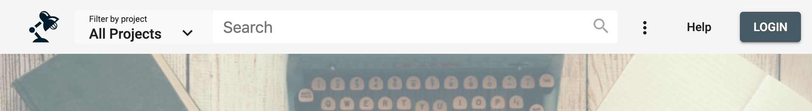

# User Guide

This is the documentation for the generic Knora web application of the Data and Service Center for Humanities DaSCH. You can reach the app on
**[app2.dasch.swiss](https://app2.dasch.swiss)**.

## Getting started

Knora Web App is an intuitive, easy to use web-based application placed on top of [Knora](developers/knora/documentation/index.md) to directly use its powerful data management functionalities. With this modern web application, the researchers will be able to add data models, search, browse, and work with their qualitative data as easily as they could with a desktop data management tool. In addition, data models and data will automatically follow accepted standards, be interoperable, findable, and re-usable. Researchers and scholars with small data sets will have access to long-term accessibility to keep their research data alive, guaranteeing longevity of the data.

## Login

To login, click on the LOGIN button of the header (right side), a login form will appear. Fill in the form with your credentials (user name or email and password). 

In case of a forgotten password, please contact the [DaSCH Team](https://dasch.swiss/team).

## Registration

You can use the Knora Web App with restricted access as guest. Otherwise, you'll need a login. At the moment, you have to contact the [DaSCH Team](https://dasch.swiss/team) to get access. In the future (end of 2020), we will support the [SWITCH edu-ID](https://www.switch.ch/edu-id/).

## Help

For any questions or help wanted, you can go to the help page, accessible from the Help button at the top right of the page (see screen shot above). Here, you can find links to the user guide, get more information about the DaSCH softwares, and get more support through different platform according to your requests.
