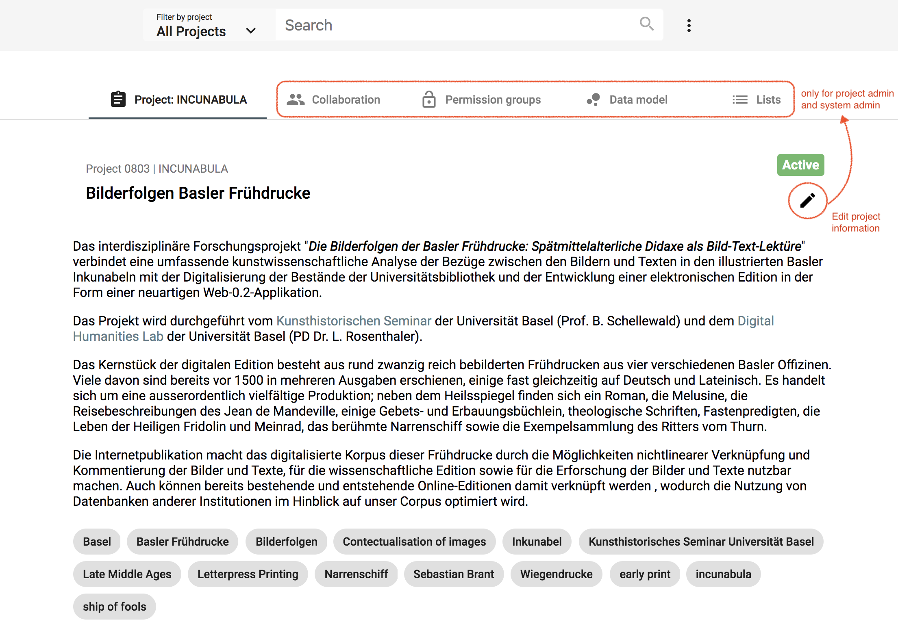
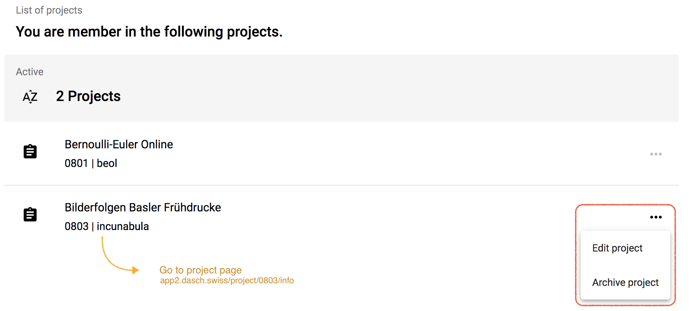
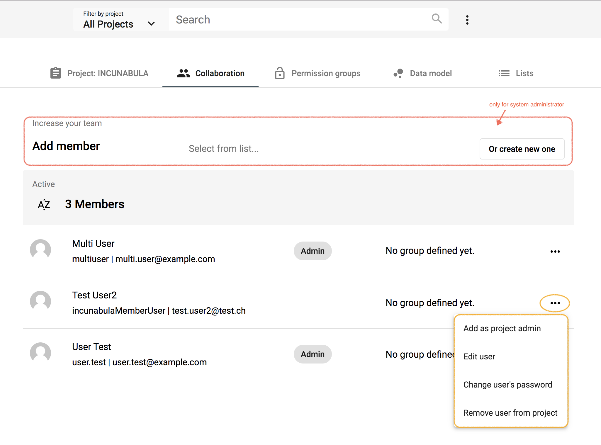
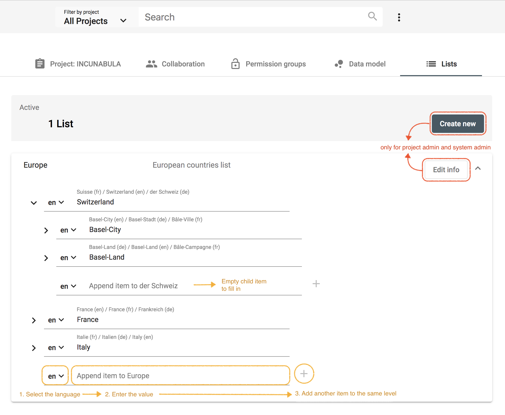

# Project Management

As a project administrator and/or system administrator, you can define your project, add your team members, create permission groups and as most important, define the data model (ontology) and the lists of your project.

*https://app2.dasch.swiss/project/0803/info - Project management functionalities; e.g. Incunabula project. Project information page is displayed without restricted content, the other functionalities are reserved for project admin and system admin.*

## Project
In Knora Web App, the targeted projects are in particular research projects with a small to medium complexity, e.g. PhD research, pilot project, or proof of concept.

Once you are logged in, the dashboard displays the list of your project(s). If you are project admin, you can edit the project information or archive your project from the project menu. Archived projects are stored in a list on your dashboard and they can be "reactivated" by project admin at any time. 

*https://app2.dasch.swiss/dashboard - By clicking on the project name, you get access to the full project information.*

System administrator can create your new research project. Essential information are required such as the project name, a short project description and institution information.

*Form to create a new project.*

## Collaboration
&#9888; *WORK IN PROGRESS*

As system admin, you can add users as project member and define their permissions roles: Who is able to edit or to see the data in the project? Data includes the research sources and their metadata. Permissions can be set for the entire project or for single metadata fields. 

A user menu with different actions is accessible for each member of the project (link to the right side of the user line). The admin can appoint another user as project admin (or remove this permission), edit user's information, change user's password if forgotten, and remove a user.

*https://app2.dasch.swiss/project/0803/collaboration - Collaboration page where project admin and system admin can add new user to the team.*

***Permissions for project admins to add new users as project member will be implemented soon.***

## Data model
&#9888; *NOT YET IMPLEMENTED* (only mockups are presented)

The most important step in the project is the definition of the data model. Knora web app will offer a tool to create data models easily. First, you have to know which data and sources you want to work with. The data model can be flexible and customizable. With Knora App, you can comply with the FAIR data standard, but compliance is not required to analyze your data.

The questions to answer in creating your data model:

- "What kind of data do I have in my project?"
- "What are the sources and what are their metadata?"

**For example:** You interviewed 20 people. During these interviews, which you taped, you talked about photographs. Of all the data collected during the project, the most important are:

- audio-files of the interview
- transcribed text of conversations (or you can transcribe the files inside the web app)
- photographs
- data about the person you interviewed
- location where the photograph was taken

Diagram 1 shows the relationships of the data by source type from these experiences.

*Relationship of the data by source type*

### Select your SOURCE TYPES

In the data model editor, you have to select your source types from a predefined list on the right-hand side. Later, you can customize the source type or define an additional default source type, if the one you need doesn't exist as a default.

*Data model editor 1: Select all your main source types by drag and drop; e.g. for an interview, select the source type "Audio / Sound / Interview".*

In our example with the interview and the photographs, you drag and drop the following main source types from the list on the right-hand side:

- Audio / Sound / Interview
- Transcript
- Image / Photograph / Postcard
- Person
- Location / Place

### Select the METADATA fields for each source type (optional)

The predefined source types offer a suggested list of metadata fields. This list could help to create a data model simply and quickly. It's also possible to deselect the suggested metadata fields (e.g., no metadata), to adapt others and to customize them.

*Data model editor 2: Add additional metadata fields to your source type; e.g. add the missing field "Person".*

### Customize the SOURCE TYPES and the METADATA fields (optional)

It's possible to customize the predefined source type and the metadata field values by clicking on the edit button of the source type. You can rename the source type, rearrange the order of the metadata fields, and set permissions.

*Data model editor 3: Customize the source type AUDIO; e.g. rename it into Interview*

### Connect SOURCE TYPES in the data model (optional)

If you have reusable metadata value in a source type (A), you should create an additional source type (B) and drag-and-drop it over the metadata field of the first source type (A) to connect the two data types.
E.g., For the metadata "Photographer" in source type "Photograph", you should create a source type "Person" and connect it in "Photograph".

*Data model editor 4: Manage connections between the source types.*

## Lists
&#9888; *WORK IN PROGRESS*

Projects often need to define lists or hierarchies of categories that can be assigned to many different sources. Lists can be created by project admin and system admin. 

*https://app2.dasch.swiss/project/0803/lists - Project lists: create a new list, add items by selecting the language and enter the corresponding value, repeat for each translation and press the + sign to create another item to the same level.*

**The edition of items and child items will be implemented in a later version.**
